<!-- Texto íntegro del informe de la campaña 03 (results/campana_03/informe/INFORME_CAMPANA_03.md del laboratorio original), reproducido sin cambios del Anexo II de la Parte II. -->

**¿Quién escribió las cartas de san Pablo? Adenda: campaña 03 (agenda G.6)**

***Informe de la campaña campana_03 (software paulinum 0.1.0, sesiones 9-14)***

**Fecha:** 9 de septiembre de 2026. **Relación con el informe final de la campaña 01:** esta adenda ejecuta los ocho puntos de la agenda G.6 del INFORME_FINAL.md (Apéndice G) y se lee junto a él; no lo sustituye ni retoca sus cifras, que quedan selladas bajo 4eb0a436.... **Ámbito:** las trece cartas del corpus paulino canónico, una a una.

**Sello de la campaña 03:** PROTOCOLO_SELLADO_campana_03.json, SHA-256 33e7b61b10d63ec486a35bbee8148fe0835918d8c6e1ec6a41e855855505b625, calculado el 9-IX-2026 a las 08:31 (hora de Barcelona) antes de mirar ningún resultado de las cartas discutidas, y reproducido en el portátil del investigador. El sello cubre el código (paulinum/, scripts/), los metadatos (metadata/\*.csv, incluidos los nuevos reuse_ranges.csv y control_variables.csv), la configuración con su bloque de preregistro (config/campana_03.yaml) y el lexicón uniforme (data/cache/lexicon_uniforme.tsv). Tres scripts de lectura escritos después del sellado (cobertura_lexicon.py, controles_genero.py, lectura_modelo_svm.py) solo leen resultados y no entran en el sello; con los dos primeros añadidos, el sello recalculado en la nube y en el portátil es 1c565b78..., y sin ellos ambos reproducen 33e7b61b....

**Fuentes textuales añadidas:** First1KGreek y Perseus canonical-greekLit (apologistas y escritores cristianos de los siglos II-III, Filón completo, pseudepígrafos judíos, Vetio Valente, Hermetica, Polemón, Aristides, epistolografía pseudoepigráfica de Hercher, Libanio); Diorisis (Vatri y McGillivray) como fuente de lemas para el lexicón, junto a MorphGNT y PROIEL. Corpus: 408 documentos, 2.220.730 tokens (191 documentos nuevos); estados con fuente en results/auditoria_sesion9.md. **Reproducibilidad:** cada cifra remite a un archivo de results/campana_03/ y a results/campana_03/bitacora.md; las referencias bibliográficas, a docs/bibliografia_verificada.md (claves A-n, B-n, E-n, F-n).

***Resumen ejecutivo***

**Qué se ha hecho.** Se han atendido los ocho «faltan» del Apéndice G.6: (1) negativos cristianos y judeo-helenísticos de los siglos I-III (el número de negativos de respuesta conocida por especificación pasa de 259 a 730; los cristianos, de 97 a 267); (2) controles de género (cartas de mandato y recomendación, apologías, himnos en prosa, exhortaciones, cartas pseudoepigráficas); (3) lematización uniforme por diccionario, aplicada por igual a los 408 documentos, para separar léxico de morfología; (4) variables de situación anotadas en los controles y PERMANOVA dentro de cada autor seguro; (5) alineación explícita Ef↔Col y 2 Tes↔1 Tes (20 tramos paralelos) y máscara que los retira de ambas cartas; (6) 300 iteraciones por problema e intervalos de confianza bootstrap del percentil del mismo rasero (por autores y por ventanas); (7) un segundo modelo independiente (SVM lineal calibrado y regresión logística sobre ventanas de 500 tokens, validado por autor); (8) cotejo de las seis fuentes pendientes.

**Qué sale.** Nada de lo añadido cambia el signo de la campaña 01; varias cosas lo precisan:

-   Las 16 especificaciones son válidas (AUC 0,826-0,943). El núcleo no da resultado adverso (GI 0,69-0,86 en leave-one-out). Ninguna carta discutida obtiene apoyo estilométrico contra la autoría paulina por encima de «débil» en ninguna especificación, ni con 730 negativos ni con los 267 cristianos.

-   **Ef, Col y 2 Tes**: GI 0,74 / 0,67 / 0,70; con negativos cristianos, «apoyo débil a la misma mano» (Ef 0,36, 2 Tes 0,30) o «no discriminante» (Col 0,24). Retirar los pasajes paralelos no mueve ninguna especificación más de 0,03: su proximidad a Pablo no se debe a la copia.

-   **Pastorales**: GI 0,58-0,60 en la mediana, pero partidas por familia de rasgos: con lemas uniformes 0,60-0,79 (como Ef/Col/2 Tes y como el núcleo), con palabras frecuentes 0,74-0,87, con clase cerrada 0,30-0,56, con trigramas de caracteres 0,10-0,35. La distancia de las Pastorales a Pablo es **morfológico-ortográfica, no léxica**; con negativos cristianos, «no discriminante» (0,13-0,17).

-   **Mismo rasero**: percentiles intra-autor 35-80 (min-max) y 6-78 (Delta); ninguna carta con IC 95 % entero por encima de 90. Tito (80/78) es la única cuyo IC cruza 90 en las dos distancias: «indeterminado», no «anómalo». La incertidumbre del percentil viene del número de autores de la envolvente (15), no de la longitud de las cartas.

-   **Desconfundido**: destinatario, polémica y longitud explican en Pablo (R² 0,04-0,06) lo mismo que en los autores seguros (0,01-0,07); el «efecto carta» paulino (0,26) está dentro del «efecto obra» de un solo autor (0,05-0,38 a igual n).

-   **Controles de género**: en autores seguros, el cambio de género dentro del autor produce GI de 0,1-0,4 (Justino, Clemente, Orígenes, Epicteto, Arriano, Lucas-Hechos, Aristides), el mismo tramo que las Pastorales; las cartas de mandato y recomendación de Libanio puntúan 0,06 frente a Pablo: el género no acerca a Pablo a quien no es Pablo. Lo que acerca es la tradición: los únicos negativos que pasan como «Pablo» (24 de 367) son cartas cristianas de c. 90-130 (Ignacio 0,57-0,78, 1 Pe 0,76, 2-3 Jn 0,66-0,70, Policarpo 0,63, 2 Pe 0,60, Santiago 0,56, 3 Cor 0,56); ningún apologista, ni Filón, ni Josefo, ni ningún pagano.

-   **Segundo modelo**: concuerda con el GI: las seis discutidas están por encima del 88-99 % de los negativos y en el tramo bajo del núcleo (con 1 Cor y Rom); en las Pastorales reaparece la partición char3 / mfw.

**Conclusión, carta por carta, en los términos del marco (H1 Pablo; H2 secretario; H3 coautoría; H4 pseudoepigrafía temprana; H5 tardía):** para Ef, Col, 2 Tes, 1 Tim, 2 Tim y Tit la estilometría **no puede descartar la autoría paulina**; sitúa a las seis en la zona que ocupan también las cartas cristianas de la generación siguiente, y solo desfavorece H5 (una falsificación tardía de otro registro, como 3 Cor, se detecta a medias). La decisión entre H1-H4 sigue dependiendo de las capas no estilométricas (recepción, papirología, crítica textual: E-1 a E-9).

***Capítulo 0 · Qué cambia en el método (agenda G.6) y qué se preregistró***

*0.1 Corpus (punto 1) y controles de género (punto 2)*

Se añadieron 60 entradas al manifiesto (sources.CONTROLS_03), que producen 191 documentos: Justino (*Apol.* I-II; *Diálogo*, 40 capítulos), Taciano, Atenágoras (*Legatio*; *De resurrectione* como disputed, F-5), Teófilo (*Ad Autolycum* I-III), Clemente de Alejandría (*Protréptico*, *Pedagogo* I-III, *Quis dives*), Orígenes (*Contra Celso* I-VIII, *De oratione*, *Exhortación al martirio*, *Carta a Africano*), *Hechos de Tomás*, *Pasión de Perpetua* (griego); Filón (34 obras; *De aeternitate* disputed), *Testamento de Abrahán*, *Vidas de los profetas*, *Enoc* griego; Vetio Valente (9 libros), *Corpus Hermeticum* I, IV, X, XIII, XVI, Polemón, Aristides (seis discursos, tres de ellos himnos en prosa), cartas de Ps-Diógenes, Ps-Eurípides y Ps-Solón (spurious) y 44 cartas de Libanio. Cada documento lleva ahora una tradition (cristiano 133, judeo-helenístico 71, pagano 204) asignada por autor, no por repositorio. Estados y fuentes: auditoria_sesion9.md. Un cambio de corpus se declara: al extender el filtro «solo tokens griegos» a todos los analizadores, Policarpo (caps. 10-12 y 14, conservados en latín), Josefo *C. Ap.* II (laguna latina) y Hermas (final latino) pierden los tokens latinos que la campaña 01 incluía por descuido; ninguna carta paulina cambia.

*0.2 Lematización uniforme (punto 3)*

scripts/construir_lexicon.py construye un diccionario forma → lema con MorphGNT (137.554 tokens), PROIEL (132.356) y Diorisis (10.052.828; las formas de Diorisis vienen en Beta Code y se convierten), tomando para cada forma sin diacríticos el lema más frecuente: 399.678 formas. El rasgo lemma_dict:300 aplica ese único diccionario a los 408 documentos (forma desconocida → la propia forma), de modo que Pablo y los controles se lematizan con la misma regla, a diferencia del rasgo lemma de la campaña 01 (solo NT). Cobertura (cobertura_lexicon.csv): 100 % en el NT; mediana 97,4 % en los controles (mínimos: Vetio Valente 82-89 %, vocabulario técnico; Alcifrón 90 %). Regla preregistrada de lectura: la señal se llama «léxica» si lemma_dict discrimina y closed no, «morfológica» en el caso inverso.

*0.3 Alineación y máscara de reutilización (punto 5)*

scripts/detectar_reutilizacion.py busca 4-gramas de formas (sin diacríticos) compartidos y los une en tramos (huecos ≤ 3, longitud ≥ 6): Ef↔Col 69 4-gramas, 7 tramos en cada carta (Ef 81 tokens, 3,4 %; Col 85, 5,4 %; p. ej. Ef 6,21-22 ∥ Col 4,7-8, el envío de Tíquico, 29 de 31 tokens idénticos); 2 Tes↔1 Tes 31 4-gramas, 3 tramos en cada una (2 Tes 37 tokens, 4,5 %; 1 Tes 41, 2,8 %: saludo, acción de gracias y despedida). La máscara reuse retira esos tramos de AMBAS cartas de cada par; la carta hermana sigue excluida de los candidatos (SISTERS). Lista completa: reutilizacion_pares.csv, metadata/reuse_ranges.csv.

*0.4 Variables de situación en los controles (punto 4)*

scripts/variables_controles.py anota los 306 documentos de autoría segura (más las 13 paulinas como referencia) con destinatario (individuo / comunidad / público / sí mismo; en las cartas de Juliano y Libanio, inferido del encabezado), género, polémica (0/1/2) y clase de longitud, y calcula, dentro de cada autor con ≥ 8 ventanas de 400 tokens, la PERMANOVA de cada variable sobre la matriz Delta (MFW200), exactamente el cálculo que la campaña 01 hizo dentro del corpus paulino, más un R² submuestreado a 76 ventanas (el n de Pablo) para comparar a igual tamaño. Salida: metadata/control_variables.csv (corregible a mano), permanova_controles.csv.

*0.5 Iteraciones e intervalos (punto 6)*

300 iteraciones por problema (100 en la campaña 01). scripts/bootstrap_percentil.py da, para el percentil del mismo rasero, (a) un IC 95 % por bootstrap de autores (2.000 remuestreos de los 15 autores de la envolvente), (b) el leave-one-author-out y (c) un IC por bootstrap de ventanas (100 réplicas de la matriz de distancias, cada una media de 20 sorteos). Regla preregistrada: si el IC cruza 90, la carta es «indeterminada», no «anómala».

*0.6 Segundo modelo (punto 7)*

scripts/modelo_svm.py: ventanas contiguas de 500 tokens (tope 20 por documento y 120 por autor; 45 ventanas del núcleo, 1.447 de negativos seguros de 27 autores), z-scores ajustados solo en el entrenamiento de cada pliegue, class_weight equilibrado; SVM lineal con calibración sigmoide y regresión logística; validación GroupKFold por autor (el autor de prueba nunca está en el entrenamiento) y leave-one-letter-out para el núcleo. Regla preregistrada: se informa la concordancia con el GI, no se elige el modelo «mejor».

*0.7 Rejilla y calibración*

16 especificaciones: {mfw:300, closed:150, char3:600, lemma_dict:300} × {min-max, Delta} × ventana 500 × {sin máscara, reuse}, con diacríticos, núcleo de siete, edición SBLGNT (las variantes sin diacríticos, documento entero, otras ediciones, ventana 300 y coseno ya se estudiaron en la campaña 02 sin cambio de signo). Por especificación: 139 positivos de respuesta conocida (7 core_loo, 60 pares intra-autor del mismo género, 72 con cambio de género) y 730 negativos (367 frente a Pablo, 351 entre autores de control, 12 pseudoepígrafos). Resultado (calibration_by_spec.csv): AUC 0,826-0,943, c@1 0,913-0,937; 16/16 válidas. Las AUC son más bajas que en la campaña 01 (0,883-0,982) porque los impostores nuevos están más cerca en registro (apologistas cristianos, Filón): Delta con mfw/lemma_dict pierde más (0,83); min-max y char3 resisten (0,93-0,94).

**Calibración secundaria** (calibracion_secundaria_cristiana.csv): AUC con negativos cristianos 0,767-0,912; AUC con positivos y negativos cristianos solamente (Ignacio, Lucas, núcleo frente a la epistolografía cristiana) 0,575-0,836; tasa de falsos positivos cristianos al umbral 0,5: 8,6-27,7 %. Con cristianos + judeo-helenísticos (\_cj): AUC 0,792-0,928.

**Positivos que fallan.** En autores seguros, el cambio de género dentro del autor produce GI bajos con la misma frecuencia que las Pastorales (§ 1 de lectura_sesion11_12.md): Justino, *Diálogo* frente a las *Apologías* 0,11-0,33 (12/12 \< 0,5); Clemente, *Pedagogo*/*QDS* frente al *Protréptico* 0,19-0,34 (5/5); Orígenes, *Contra Celso* frente a *Orat.*/*Mart.*/*Ep. Afr.* 0,32-0,38 (9/12); Epicteto 0,21-0,35; Arriano 0,37-0,44; Lucas-Hechos 0,30-0,33; Aristides 0,34-0,62 (4/6). Los autores con obras del mismo género puntúan 0,77-0,97. **Un GI de 0,2-0,4 es compatible con «mismo autor, otro género» en al menos siete autores seguros.**

**Negativos que pasan.** 24 de 367 (mediana entre specs ≥ 0,5), todos cristianos y casi todos cartas (Ignacio 0,57-0,78, 1 Pe 0,76, 2 Jn 0,70, 3 Jn 0,66, Policarpo 0,63, 2 Pe 0,60, Santiago 0,56, 3 Cor 0,56, siete cartas de Ps-Ignacio 0,50-0,64, 2 Clem 0,52, dos capítulos del *Diálogo* 0,52-0,55); 0 de 70 judeo-helenísticos y 0 de 187 paganos. Pseudoepígrafos: 4 de 12 pasan (3 Cor 0,54, Ps-Plutarco *De lib. educ.* 0,52, Ps-Ignacio #9 0,68 y #10 0,59).

***Capítulos por epístola***

Formato de cada ficha: GI = mediana (Q1-Q3; mín-máx) entre las 16 especificaciones y número de especificaciones ≥ 0,5; LR = log10 de la razón de verosimilitud, mediana con todos los negativos / con negativos cristianos / con cristianos y judeo-helenísticos; percentil = posición de la distancia media al núcleo entre los 755 pares intra-autor de los controles (min-max / Delta), con IC 95 % por bootstrap de autores y valor sin el autor más influyente; 2.º modelo = percentil de P(Pablo) entre los negativos en validación cruzada / entre las cartas del núcleo en leave-one-out (mediana de 8 modelos). Archivos: summary_by_letter.csv, gi_results_all_specs.csv, lr_secundaria_por_carta.csv, lr_secundaria_por_carta_cj.csv, double_standard_ledger\_{minmax,delta}.csv, bootstrap_percentil\_{minmax,delta}.csv, modelo_svm_percentiles_resumen.csv, rolling_scores.csv.

*Capítulos 1-7 · El núcleo (Rom, 1 Cor, 2 Cor, Gal, Flp, 1 Tes, Flm), en leave-one-out*

  ----------------------------------------------------------------------------------------------------------------------------
  carta     tokens     GI (Q1-Q3)         LR todos / cristiana   percentil mm / Δ    2.º modelo    rolling (ventanas \< 0,5)
  --------- ---------- ------------------ ---------------------- ------------------- ------------- ---------------------------
  Rom       7055       0,73 (0,68-0,78)   0,58 / 0,37            60 \[37-85\] / 11   0,97 / 0,25   2 de 67

  1 Cor     6812       0,69 (0,65-0,73)   0,49 / 0,29            68 \[45-93\] / 29   0,97 / 0,17   5 de 65

  2 Cor     4473       0,86 (0,83-0,87)   1,03 / 0,93            28 \[15-46\] / 5    1,00 / 0,92   0 de 41

  Gal       2226       0,80 (0,80-0,84)   0,86 / 0,65            56 \[34-79\] / 21   0,99 / 0,83   0 de 19

  Flp       1626       0,77 (0,71-0,82)   0,69 / 0,50            37 \[21-56\] / 6    0,98 / 0,50   0 de 13

  1 Tes     1473       0,71 (0,70-0,83)   0,64 / 0,43            43 \[24-63\] / 11   0,99 / 0,50   ---

  Flm       334        0,86 (0,80-0,88)   1,09 / 0,85            50 \[28-72\] / 14   0,99 / 0,75   ---
  ----------------------------------------------------------------------------------------------------------------------------

Lectura. Sin resultado adverso: las siete cartas tienen 16/16 especificaciones ≥ 0,5 (mínimo absoluto 0,553 en Rom y 1 Cor). Con negativos cristianos, el propio núcleo solo alcanza «apoyo débil» (Rom, Gal, Flp, 1 Tes, Flm, 2 Cor: 0,37-0,93) o «no discriminante» (1 Cor 0,29): ese es el techo que el método puede dar a una carta paulina auténtica frente a la epistolografía cristiana, y por tanto el listón de las discutidas. El percentil intra-autor de 1 Cor tiene IC 45-93 y el de Rom 37-85: incluso dentro del núcleo la incertidumbre por autores es grande; ninguna carta del núcleo queda «anómala». En el segundo modelo, 1 Cor y Rom ocupan el tramo bajo del núcleo (percentil 0,17-0,25 entre las demás cartas), lo que se debe tener presente al leer Ef y Col. Rolling (ventanas de 400 tokens, paso 100, 60 iteraciones): 9 ventanas de 259 por debajo de 0,5: 5 en 1 Cor (caps. 7 y 12-14), 2 en Rom (diatriba de Rom 1-3), 1 en Ef y 1 en 1 Tim, como en la campaña 01.

*Capítulo 8 · Efesios*

GI 0,735 (0,62-0,80; 0,49-0,83), 14/16 ≥ 0,5 (las dos \< 0,5 son closed/Delta 0,49). Por familia: char3 0,67-0,81, mfw 0,77-0,81, lemma_dict 0,62-0,83, closed 0,49-0,62. LR 0,55 / **0,36** / 0,44: «apoyo débil a la misma mano» con negativos cristianos (Q1-Q3 0,26-0,47; extremos 0,08-0,53). Máscara reuse (81 tokens retirados): 0,81 → 0,80, 0,67 → 0,70, 0,77 → 0,78, 0,62 → 0,63, 0,81 → 0,78...: sin cambio de signo ni diferencia \> 0,03; **la cercanía de Ef al núcleo no se debe a lo que comparte con Col**. Percentil 47 \[25-68\] (41 sin Josefo) / 6 \[2-12\]: distancia corriente entre obras de un mismo autor. Segundo modelo: P(Pablo) logística 0,62-0,93 según rasgos; por encima del 96 % de los negativos, en el percentil 21 del núcleo (con 1 Cor). Rolling: 1 ventana de 21 \< 0,5 (0,42). Comparación con la campaña 01, a igualdad de especificación: 0,40-0,73 → 0,49-0,81. Lectura H1-H5: H1 no excluible; el rasgo litúrgico y la condición de circular (E-4, E-8: «ἐν Ἐφέσῳ» ausente en 𝔓⁴⁶, א\*, B) no se traducen en distancia estilística anómala; la estilometría no distingue H1-H4; desfavorece H5.

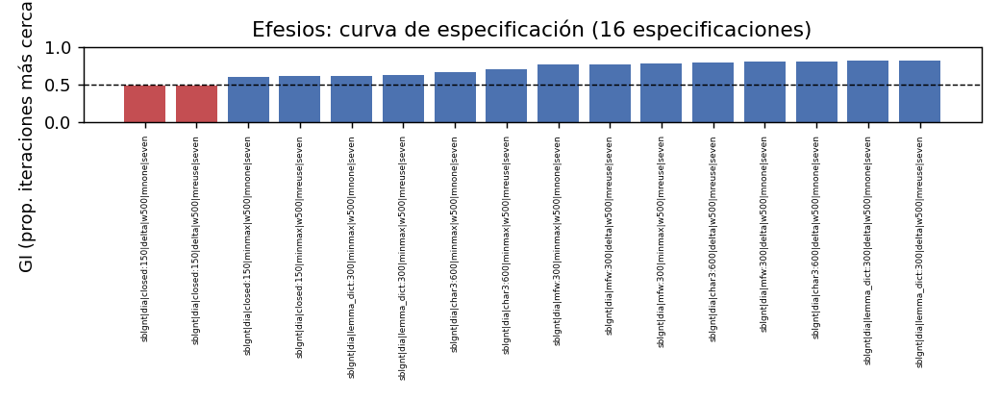

Ef: curva de especificación (16 especificaciones de la campaña 03)

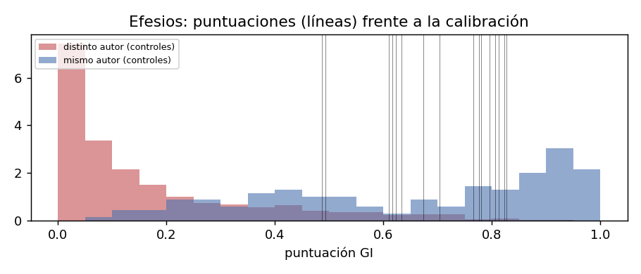

Ef: puntuación frente a la calibración (positivos y negativos de respuesta conocida)

*Capítulo 9 · Colosenses*

GI 0,672 (0,61-0,75; 0,45-0,79), 14/16 ≥ 0,5 (closed/Delta 0,45). Por familia: char3 0,73-0,75, mfw 0,65-0,70, lemma_dict 0,63-0,79, closed 0,45-0,55. LR 0,49 / **0,24** / 0,33: «no discriminante» con negativos cristianos (Q1-Q3 0,14-0,31). Máscara reuse (85 tokens): diferencias ≤ 0,03, sin cambio de signo. Percentil 69 \[47-94\] (78 sin Juliano) / 15 \[8-24\]: el IC min-max cruza 90 (como el de 1 Cor): «indeterminado» por la regla, no anómalo; con Delta, claramente corriente. Segundo modelo: 0,44-0,89; por encima del 97 % de los negativos; percentil 29 del núcleo. Rolling: 0 de 12 ventanas \< 0,5 (mín. 0,50; en la campaña 01, 3 de 12, y el tramo 2,10-3,18 bajo: ahora 0,50-0,83). Campaña 01 → 03 a igual spec: 0,52-0,74 → 0,45-0,75. Lectura: H1 no excluible; con 300 iteraciones y corpus ampliado Col es la discutida con LR cristiana más baja, pero positiva en 16/16 specs; el himno (1,15-20) y el código doméstico ya se enmascaraban en la campaña 01 sin efecto de signo.

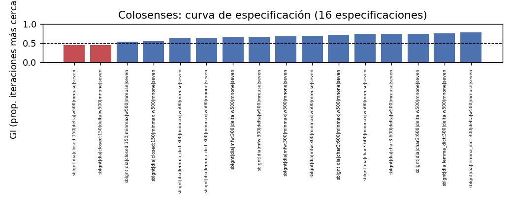

Col: curva de especificación (16 especificaciones de la campaña 03)

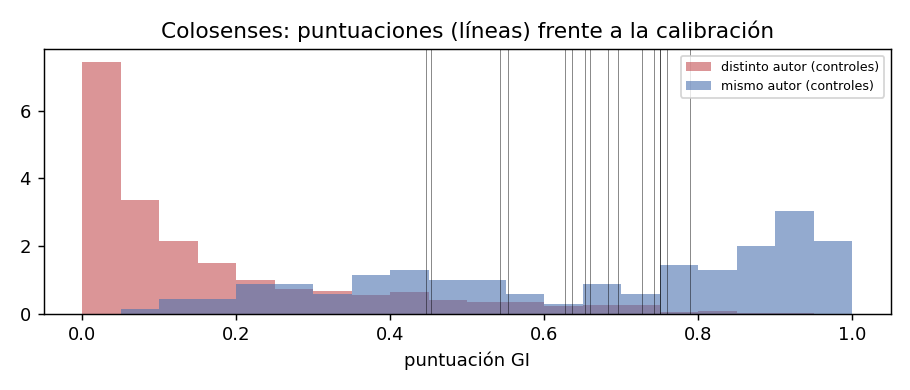

Col: puntuación frente a la calibración (positivos y negativos de respuesta conocida)

*Capítulo 10 · 2 Tesalonicenses*

GI 0,695 (0,69-0,77; 0,59-0,79), **16/16 ≥ 0,5**, la más estable de las seis (Q1 0,69). Por familia: char3 0,69-0,70, mfw 0,69-0,77, lemma_dict 0,77-0,79, closed 0,59-0,68. LR 0,55 / **0,30** / 0,41: «apoyo débil» con negativos cristianos (0,25-0,36). Máscara reuse (37 tokens en 2 Tes, 41 en 1 Tes): diferencias ≤ 0,03. Con 1 Tes como candidata (target_sister) sube a 0,75-0,94: mide la copia, no la mano, y por eso no cuenta. Percentil 36 \[20-55\] / 10 \[4-18\]; bootstrap de ventanas (carta de 820 tokens) 16-36. Segundo modelo: 0,94-1,00 en las cuatro familias (logística), percentil 99 entre negativos y 50 dentro del núcleo, la discutida mejor situada. Campaña 01 → 03: 0,58-0,64 → 0,60-0,77. Lectura: H1 no excluible; nada en el estilo separa 2 Tes de 1 Tes más allá de lo que se copia; H5 desfavorecida.

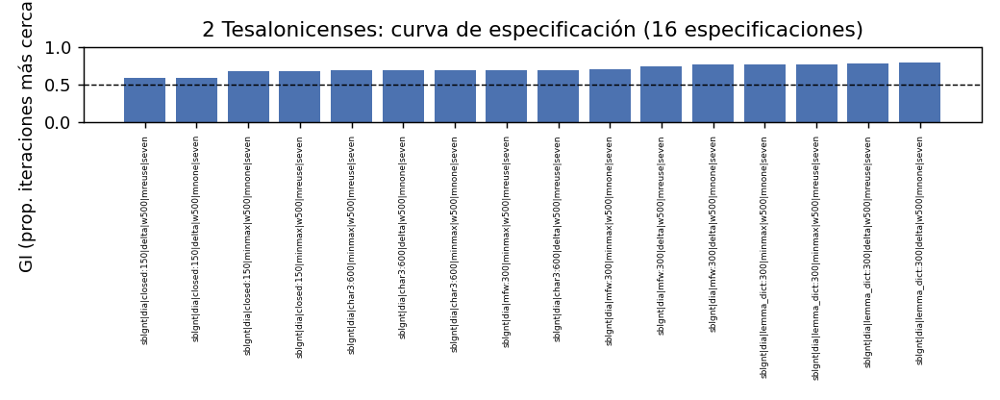

2Tes: curva de especificación (16 especificaciones de la campaña 03)

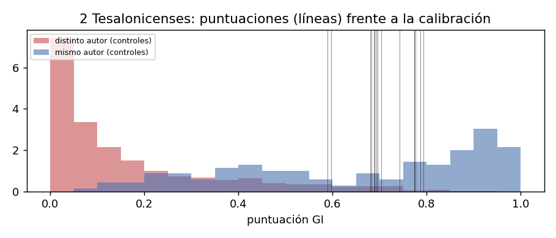

2Tes: puntuación frente a la calibración (positivos y negativos de respuesta conocida)

*Capítulo 11 · 1 Timoteo*

GI 0,598 (0,34-0,79; 0,16-0,86), 8/16 ≥ 0,5: bimodal por familia de rasgos: lemma_dict 0,74-0,78, mfw 0,79-0,86, closed 0,35-0,46, char3 0,16-0,32. LR 0,36 / **0,13** / 0,23: «no discriminante» (Q1-Q3 −0,11 a 0,42; char3 −0,22 a −0,36 con cristianos, mfw +0,41 a +0,83). Máscara reuse: no aplica (sin hermana); diferencias entre las dos máscaras (solo cambia el sorteo) ≤ 0,03. Percentil 57 \[35-80\] (64 sin Juliano) / 33 \[18-50\]: corriente. Segundo modelo: la más baja de las trece en P(Pablo) (0,06-0,59 según rasgos; char3 0,08, closed 0,06, mfw 0,39, lemma 0,59), pero aun así por encima del 95 % de los negativos; percentil 7 del núcleo. Rolling: 1 de 12 ventanas \< 0,5 (0,43); mediana 0,82. Lectura preregistrada de la lematización: **la señal es morfológico-ortográfica, no léxica**: con el mismo diccionario de lemas para todos, 1 Tim está tan cerca de Pablo como Ef o 2 Tes; lo que la aleja son los trigramas de caracteres (flexión, sufijación, ortografía de la edición), que separan también a Justino de Justino y a Orígenes de Orígenes cuando cambian de género (cap. 0). Género: como carta de mandato (F-4: Johnson la clasifica así), su comparable de autoría segura (Ignacio a Policarpo, cartas de mandato de Libanio) no se aleja de su autor; la analogía no funciona en contra. H1 no excluible; H2/H3 indistinguibles de H4 por estilo; H5 desfavorecida.

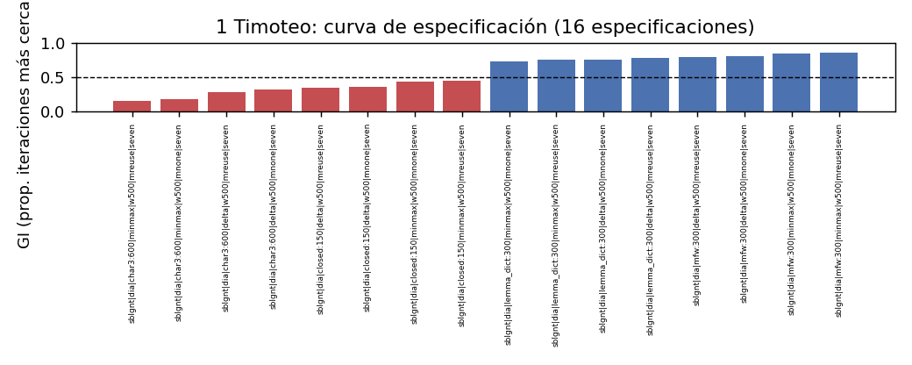

1Tim: curva de especificación (16 especificaciones de la campaña 03)

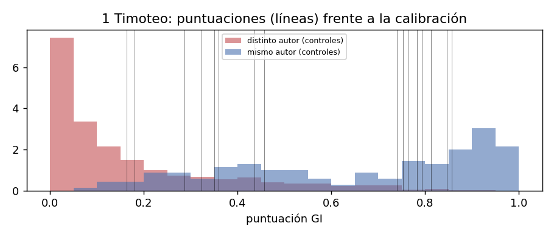

1Tim: puntuación frente a la calibración (positivos y negativos de respuesta conocida)

*Capítulo 12 · 2 Timoteo*

GI 0,597 (0,32-0,77; 0,26-0,79), 8/16 ≥ 0,5: lemma_dict 0,77-0,79, mfw 0,74-0,78, closed 0,30-0,45, char3 0,26-0,35. LR 0,35 / **0,15** / 0,24: «no discriminante» (−0,15 a 0,33). Percentil 35 \[19-54\] (30 sin Isócrates) / 21 \[10-34\]: la más «corriente» de las Pastorales en el mismo rasero. Segundo modelo: 0,25-0,80 (char3 0,42, closed 0,25, mfw 0,80, lemma 0,40); por encima del 97 % de los negativos; percentil 7 del núcleo. Rolling: 0 de 9 ventanas \< 0,5 (mín. 0,60; mediana 0,73). Género testamentario (Prior 1989, F-2, cap. 5 «Second Timothy: A Farewell Letter?»; 2 Pe, la otra carta testamentaria del corpus, puntúa 0,60 frente a Pablo sin ser paulina): el género no explica ni la cercanía ni la lejanía. Lectura: H1 no excluible; la misma partición char3 / léxico que 1 Tim; H5 desfavorecida.

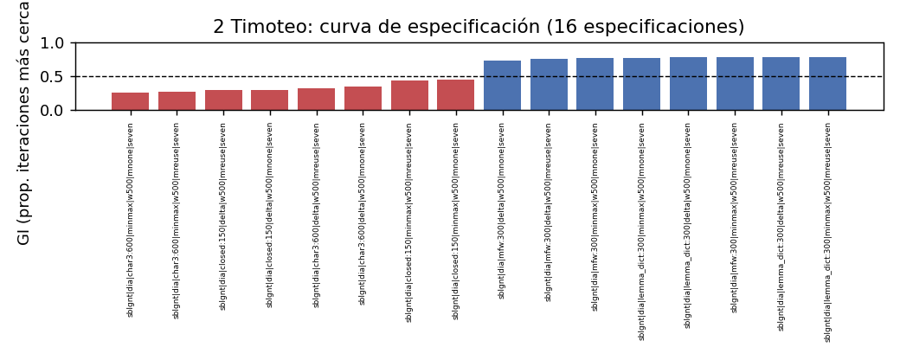

2Tim: curva de especificación (16 especificaciones de la campaña 03)

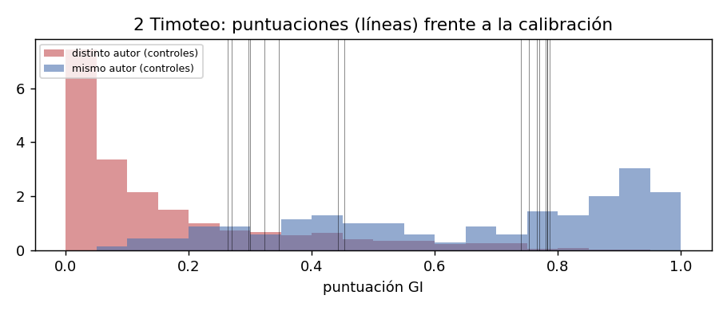

2Tim: puntuación frente a la calibración (positivos y negativos de respuesta conocida)

*Capítulo 13 · Tito*

GI 0,577 (0,41-0,76; 0,10-0,87), 10/16 ≥ 0,5: lemma_dict 0,60-0,75, mfw 0,78-0,87, closed 0,48-0,56, char3 0,10-0,19 (los cuatro valores más bajos de las trece cartas). LR 0,38 / **0,17** / 0,26: «no discriminante» (extremos −0,55 char3/min-max y +0,79 mfw/Delta). Percentil **80 \[63-100\]** (88 sin Juliano) / **78 \[62-95\]** (85 sin Juliano): la única carta cuyo IC cruza 90 en las dos distancias → **«indeterminado»** por la regla preregistrada; el bootstrap de ventanas (carta de 659 tokens) da 76-81, es decir, la incertidumbre no viene de la brevedad sino de qué autores forman la envolvente (Juliano e Isócrates, con muchas cartas cortas, son los más influyentes). Segundo modelo: 0,00-0,98 según rasgos (char3 0,00, closed 0,96, mfw 0,98, lemma 0,57): la partición más extrema del corpus; por encima del 97 % de los negativos; percentil 21 del núcleo. Lectura: Tito es la carta en la que más se separa lo morfológico-ortográfico (que la aleja) de lo léxico y de las palabras frecuentes (que la acercan); en la campaña 01 ya era la de percentil más alto (78/72). H1 no excluible; es la discutida con más argumentos estilométricos en contra, y aun así ninguno pasa de «débil» ni de «indeterminado».

***Capítulo final · Síntesis convergente (con los añadidos de la campaña 03)***

**1. ¿Separa el estilo a alguna carta discutida de Pablo?** No, en ninguna especificación con fuerza mayor que «débil» (\|log10 LR\| \< 1 en todas con negativos cristianos), ni en el mismo rasero (ningún IC entero \> 90), ni en el segundo modelo (las seis por encima del 88-99 % de los negativos). Lo nuevo: **la máscara de reutilización no cambia nada** (Ef, Col, 2 Tes no están cerca de Pablo por copia), y **el segundo modelo concuerda** con el GI en las seis cartas y en la partición por rasgos de las Pastorales.

**2. ¿Qué es lo que aleja a las Pastorales?** Con la lematización uniforme la respuesta preregistrada es «morfológico-ortográfico»: con lemas y palabras frecuentes las tres están donde Ef/Col/2 Tes y el núcleo (0,60-0,87); con trigramas de caracteres, en 0,10-0,35. Ese tramo es el que ocupan, en autores seguros, las obras de otro género (Justino, Clemente, Orígenes, Epicteto, Arriano, Lucas-Hechos, Aristides). La estilometría **no puede decidir** si esa diferencia es de mano (H4/H5), de secretario (H2), de coautoría (H3) o de género y edición (H1): las cuatro producen la misma huella en los controles.

**3. ¿Es la heterogeneidad interna del corpus paulino un indicio de varias manos?** No más que en cualquier autor seguro: el efecto carta (0,26) cae dentro del efecto obra de Isócrates (0,18), Plutarco (0,19), Filón (0,38 a igual n); las variables de situación explican en Pablo lo que en ellos.

**4. ¿Dónde se equivoca el método?** Solo con la epistolografía cristiana de c. 90-130 (Ignacio, 1-2 Pe, 2-3 Jn, Policarpo, Santiago, 3 Cor, Ps-Ignacio): 24 de 367 negativos, todos de esa zona; 0 paganos y 0 judeo-helenísticos, incluidos apologistas, Filón y Josefo. Las seis discutidas puntúan **en esa misma zona** (0,58-0,74). Por eso el resultado es simétrico: la estilometría no da a favor de la autoría paulina más de lo que da a Ignacio o a 1 Pedro, ni en contra más de lo que da al propio núcleo en leave-one-out.

**5. Agrupaciones.** Ef y Col siguen yendo juntas (0,74 / 0,67; LR cristiana 0,36 / 0,24), y 2 Tes con ellas (0,70 / 0,30); las tres Pastorales entre sí (0,58-0,60; 0,13-0,17), con Tito como la más separada en char3 y en el mismo rasero. Ninguna agrupación se apoya en pasajes copiados.

**6. Lo que sigue faltando (agenda G.6 revisada).** (a) Envolvente con más autores de cartas cortas de autoría segura (la incertidumbre del percentil es por autores); (b) un corpus de comparación de cartas cristianas de c. 90-130 con autor conocido y varias cartas por autor (hoy solo Ignacio) para calibrar la LR «cristiana» con positivos de la misma generación; (c) lectura filológica de qué trigramas separan a las Pastorales (feature_contributions.csv solo cubre mfw); (d) contenido de F-1 a F-4 cotejado página a página; (e) NA28 y las transcripciones de 𝔓⁴⁶/א/B leídas directamente (E-8 se apoya en fuente secundaria).

***Apéndices***

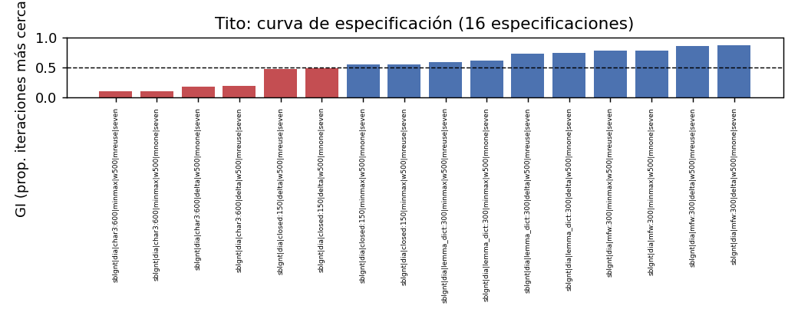

Tit: curva de especificación (16 especificaciones de la campaña 03)

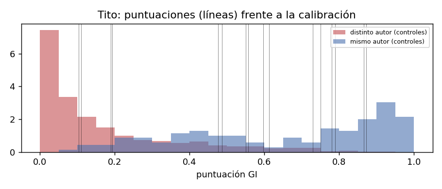

Tit: puntuación frente a la calibración (positivos y negativos de respuesta conocida)

*A. Archivos de la campaña 03 (results/campana_03/)*

config_used.json; inventory.csv; run.log; specs/000-015.json; gi_results_all_specs.csv (14.128 filas); calibration_by_spec.csv; summary_by_letter.csv; calibracion_secundaria_cristiana{,\_cj}.csv, lr_secundaria_por_spec{,\_cj}.csv, lr_secundaria_por_carta{,\_cj}.csv; distance_matrix\_{minmax,delta}.npy, distance_matrix_ids.csv, pair_distances\_\*.csv, double_standard_ledger\_\*.csv; bootstrap_percentil\_\*.csv, loo_autor_percentil\_\*.csv; permanova_pauline_windows.csv, dbrda_partition_pauline_windows.{csv,txt}, permanova_controles.csv; edition_noise_pairs.csv, feature_contributions.csv, descriptives.csv; rolling_scores.csv; reutilizacion_pares.csv; cobertura_lexicon.csv; controles_genero{,\_resumen,\_documentos}.csv; modelo_svm\_{cv,por_doc,por_carta} {,\_cristiano}.csv, modelo_svm_percentiles{,\_resumen}{,\_cristiano}.csv; informe/INFORME_AUTOMATICO.md y 37 figuras; lectura_sesion11_12.md; bitacora.md. Fuera de la carpeta: metadata/reuse_ranges.csv, metadata/control_variables.csv, data/cache/lexicon_uniforme.tsv (SHA-256 eb404ee2...), data/cache/corpus_sblgnt_dia_t2_s10.pkl (67911733...), results/auditoria_sesion9.md.

*B. Fuentes verificadas en esta campaña (docs/bibliografia_verificada.md)*

E-5 Tertuliano, *Adv. Marc.* V 21 (CCEL, ANF 3): «To this epistle alone did its brevity avail to protect it against the falsifying hands of Marcion. I wonder, however, when he received ... this letter which was written but to one man, that he rejected the two epistles to Timothy and the one to Titus». E-8 Ef 1,1 (DelHousaye 2018, ETC). E-9 Eusebio, *HE* IV 18 (obras de Justino). F-1 Richards 2004; F-2 Prior 1989 (portada, índice, prefacio p. 8); F-3 Murphy-O'Connor 1995; F-4 Johnson 2001 (reseña: «1 Timothy as a mandate letter to a delegate and 2 Timothy as a personal parenetic letter»); F-5 Grant 1954 / Kiel 2016; F-6 Conybeare 1895. Siguen sin cotejar en su contenido: F-1, F-3, F-5, F-6 y la sección D.

*C. Advertencia de lectura*

Ninguna cifra de este informe demuestra autenticidad ni la excluye. «GI 0,74» significa que en el 74 % de las iteraciones la carta estuvo más cerca de alguna carta del núcleo que de cualquier impostor; «log10 LR 0,36» que la puntuación observada es 2,3 veces más frecuente entre pares del mismo autor que entre pares de autores distintos en los controles cristianos; «percentil 80» que el 80 % de las distancias entre obras de un mismo autor de control son menores. Con ese vocabulario, y no con otro, se han escrito los capítulos anteriores.
