<!-- Texto íntegro del informe final de la campaña 01 (results/campana_01/informe/INFORME_FINAL.md del laboratorio original), reproducido sin cambios del Anexo I de la Parte II de «¿Quién escribió las cartas de san Pablo?». Las claves bibliográficas (A-n, B-n, E-n) remiten a docs/bibliografia_verificada.md. Las figuras conservadas son las que el libro reproduce; el informe original llevaba 37 figuras generadas por paulinum. -->

**¿Quién escribió las cartas de san Pablo? Verificación convergente de la autoría del corpus paulino canónico**

***Informe final de la campaña campana_01 (software paulinum 0.1.0)***

**Fecha:** 9 de septiembre de 2026. **Autor del estudio:** el investigador titular del proyecto, con Cowork como ejecutor de las sesiones 0-8 del plan (docs/04). **Ámbito:** trece cartas del corpus paulino canónico, tratadas una a una; la Carta a los Hebreos queda fuera por no llevar el nombre de Pablo.

**Campañas y sellos (SHA-256 del código, la configuración y los metadatos, calculados en dos máquinas con resultado idéntico):**

  ---------------------------------------------------------------------------------------------------------------------------------------------------------------------------------
  campaña                  contenido                                                                             sello
  ------------------------ ------------------------------------------------------------------------------------- ------------------------------------------------------------------
  campana_01 (principal)   48 especificaciones, 100 iteraciones; variables no autorales; mismo rasero; rolling   4eb0a43658f14fa69391faa47e6c4508d02e327ffdfea2737f033b45fa6d08e2

  campana_02a_nucleos      núcleo seven / Hauptbriefe / seven_plus (9)                                           b19ff50ab9111abefc142d24b0cb2e7948e8ed6298a75fad2da2f7c719504105

  campana_02b_ediciones    SBLGNT / Tischendorf / Nestle 1904 (9)                                                d19b0a6acd13a8011d153a7eeba4324586e6fc9ac5b6a971443c8949ef95c19d

  campana_02c_ventana300   ventana 300 (6)                                                                       fb8a0f9247627c2a8fa68b1bd93b0617853931e594184b49a60dfbd23057cfac

  campana_02d_rasgos       mfw:100, mfw:500, char4:1000 (6)                                                      4973f2627a9905fb05aa4a2f078ded5d66b823cf2b9531d760409c5682dc059d

  campana_02e_coseno       distancia coseno (3)                                                                  0edef83ff6a9406e02fef03b4ed90214bc280d159a48841464a6e2cafb2c2d6b
  ---------------------------------------------------------------------------------------------------------------------------------------------------------------------------------

**Fuentes textuales:** MorphGNT/SBLGNT 6.12 (NT), Open Apostolic Fathers (Lake), PROIEL (Tischendorf), MACULA (Nestle 1904), Perseus canonical-greekLit y First1KGreek (controles), 3 Corintios (P. Bodmer X, Testuz, vía transcripción); 217 documentos, 1.170.008 tokens; hashes de cada archivo en data/provenance.json. **Reproducibilidad:** cada cifra de este informe remite a un archivo de results/campana_01/ (o de la campaña 02 indicada) y a la bitácora results/campana_01/bitacora.md; las referencias bibliográficas remiten a docs/bibliografia_verificada.md por su clave (A-n, B-n, E-n).

***Resumen ejecutivo***

**Qué se ha hecho.** Se ha medido, para cada una de las trece cartas, si se parece más a las siete cartas del núcleo indiscutido (Rom, 1 Cor, 2 Cor, Gal, Flp, 1 Tes, Flm) que a un conjunto de impostores griegos de los siglos IV a. C.-IV d. C. (método de los impostores generales, A-1, A-2), repitiendo la medida bajo 48 combinaciones preregistradas de rasgos, distancia, ventana, máscara y ortografía, y calibrando antes el mismo procedimiento en 406 problemas de respuesta conocida (obras de un mismo autor de control, obras de autores distintos, pseudoepigrafías conocidas). Cada distancia paulina se ha situado además dentro de la distribución de distancias que aceptamos sin discusión entre obras de un mismo autor de control (Josefo, Juliano, Plutarco, Isócrates, Ignacio...): el «mismo rasero». Después se ha comprobado cuánto de la variación interna del corpus explican las variables de situación, se ha buscado heterogeneidad dentro de cada carta, y se ha repetido el análisis cambiando un factor por vez (núcleo, edición, ventana, rasgos, distancia) en cinco campañas de robustez selladas.

**Tabla resumen** (summary_by_letter.csv, double_standard_ledger\_{minmax,delta}.csv, lr_secundaria_por_carta.csv, tabla_resumen_13_cartas.csv). GI = fracción de iteraciones en que la carta está más cerca del núcleo que de cualquier impostor; LR = razón de verosimilitud calibrada (log10; «cristiana» = calibrada solo con negativos cristianos); percentil = posición de la distancia al núcleo entre las distancias intra-autor de los controles (min-max / Delta).

  ------------------------------------------------------------------------------------------------------------------------------------------------------------------------------------------------------------------------------------------------------------------------------------------------------
  carta       tokens   GI mediana (Q1-Q3)   log10 LR (Q1-Q3)    log10 LR cristiana   escala verbal                 percentil intra-autor   principales derrotadores                                          lectura H1-H5 en una línea
  ----------- -------- -------------------- ------------------- -------------------- ----------------------------- ----------------------- ----------------------------------------------------------------- -------------------------------------------------------------------------------------------
  Rom         7055     0,87 (0,69-0,99)     0,86 (0,51-1,69)    0,60                 débil-moderado a misma mano   59 / 6                  diatriba (Rom 1-3) heterogénea; Tercio como escriba               referencia del núcleo (H1-H3)

  1 Cor       6812     0,82 (0,63-0,99)     0,81 (0,42-1,72)    0,55                 débil-moderado                66 / 19                 tramos 7 y 12-14 en 0,42-0,48                                     referencia (H1-H3)

  2 Cor       4473     0,89 (0,79-1,00)     1,11 (0,87-1,71)    1,03                 moderado                      25 / 2                  posible compilación; no se detecta                                referencia (H1-H3)

  Gal         2226     0,92 (0,74-1,00)     1,34 (0,78-1,74)    1,39                 moderado                      52 / 16                 ---                                                               referencia (H1-H3)

  Flp         1626     0,76 (0,60-0,94)     0,65 (0,38-1,04)    0,33                 débil                         32 / 3                  la más «débil» del núcleo; himno                                  referencia (H1-H3)

  1 Tes       1473     0,84 (0,70-0,96)     0,76 (0,57-1,38)    0,55                 débil-moderado                45 / 6                  «nosotros» dominante                                              referencia (H1-H3)

  Flm         334      0,78 (0,67-0,90)     0,76 (0,46-1,07)    0,52                 débil-moderado                53 / 7                  334 tokens                                                        referencia (H1-H3)

  **Ef**      2416     0,66 (0,59-0,75)     0,39 (0,19-0,52)    0,07                 **no discriminante**          54 / 3                  registro litúrgico; dependencia de Col; circular                  H1 no excluible; el estilo no separa H1 de H2-H5

  **Col**     1580     0,66 (0,55-0,75)     0,37 (0,10-0,53)    0,06                 **no discriminante**          67 / 7                  himno y código; tramo 2,10-3,18 bajo                              H1 no excluible; ídem

  **2 Tes**   820      0,67 (0,59-0,81)     0,38 (0,28-0,57)    0,08                 **no discriminante**          22 / 3                  820 tokens; dependencia de 1 Tes                                  H1 no excluible; ídem

  **1 Tim**   1591     0,52 (0,26-0,73)     0,11 (−0,17-0,49)   −0,20                **no discriminante**          56 / 17                 desacuerdo entre familias; instrucción; destinatario individual   H1 no excluible por estilo; distancia léxico-morfológica

  **2 Tim**   1235     0,48 (0,28-0,68)     0,05 (−0,13-0,38)   −0,27                **no discriminante**          33 / 17                 ídem; noticias personales                                         H1 no excluible por estilo

  **Tit**     659      0,48 (0,11-0,63)     0,07 (−0,50-0,29)   −0,26                **no discriminante**          **78 / 72**             la más alejada; 659 tokens; gramática de la instrucción           H1 no excluible por estilo; la carta más distante del núcleo, aún dentro de la envolvente
  ------------------------------------------------------------------------------------------------------------------------------------------------------------------------------------------------------------------------------------------------------------------------------------------------------

**Tres párrafos.** *Qué separa el estilo.* Bajo el protocolo sellado, el estilo separa con claridad el núcleo paulino de la prosa no cristiana (AUC 0,88-0,98 en las 48 especificaciones) y reconoce cada carta del núcleo frente a las otras seis (leave-one-out 0,76-0,92). Separa también, en una dirección, a las tres Pastorales del núcleo cuando se miden por morfología y léxico propio (n-gramas de caracteres: 0,07-0,24), y sitúa a Efesios, Colosenses y 2 Tesalonicenses por debajo de todas las cartas del núcleo (0,66-0,67 frente a 0,76-0,92).

*Qué no separa.* Con la clase cerrada pura ---la medida más neutra respecto del tema--- las seis cartas discutidas quedan en 0,40-0,61: por debajo del núcleo, muy por encima de los negativos, y sin diferencia neta entre Efesios y 1 Timoteo. Con las palabras más frecuentes, las Pastorales están dentro del núcleo (0,72-0,82). Ninguna de las seis tiene una distancia al núcleo que sea inusual entre obras de un mismo autor de control (percentiles 22-78, regla preregistrada ≤ 90), y las diferencias observadas son del mismo orden que las que la situación (polémica, co-remitentes, registro) produce dentro del propio corpus (23,5 % de la variación frente al 26 % de la identidad de carta). Las tres falsificaciones que el método no detecta (3 Corintios, Ps-Ignacio a los Antioquenos, *De liberis educandis*) puntúan 0,57-0,75, en la zona de Efesios y Colosenses; y los tramos internos más bajos de Romanos y 1 Corintios (0,42-0,48) puntúan como las Pastorales.

*Qué no puede decidir el estilo.* Un secretario con libertad amplia, un colaborador que redacta en vida de Pablo y bajo su nombre, un discípulo posterior y un imitador ajeno producen, por estilo, el mismo resultado: «no es exactamente la mano del núcleo». El estilo separa a lo sumo H1 de {H2-H5}; H2/H3 frente a H4/H5 se decide, si acaso, con las capas no estilométricas (recepción temprana, papirología, prosopografía, crítica textual), que este informe recoge en el ledger de cada carta con las fuentes que ha podido verificar. Para las seis cartas discutidas la conclusión estilométrica es la misma y se enuncia con la fórmula preregistrada: **no puede descartarse la autoría paulina por razones estilométricas; la decisión depende de las capas no estilométricas.** Lo que cambia de carta a carta es el detalle: dónde está la distancia, de qué está hecha y qué la explicaría.

***Capítulo 0 · Método y calibración***

*0.1 Corpus*

Núcleo: Rom, 1 Cor, 2 Cor, Gal, Flp, 1 Tes, Flm (23.999 tokens). Dianas: Ef, Col, 2 Tes, 1 Tim, 2 Tim, Tit (8.301 tokens). Impostores y controles (results/inventory.csv, results/auditoria_sesion2.md): 135 documentos de autoría segura (Josefo 30 libros, Juliano 66 cartas, Isócrates 8 cartas y 5 discursos, Plutarco 7 opúsculos, Luciano 5, Arriano 8, Epicteto 5, Filón 3, Marco Aurelio 12, Ignacio 7, Policarpo, 1 Clemente, Hermas, Alcifrón, Filóstrato, Lucas-Hechos), 21 pseudoepigrafías conocidas (Ps-Ignacio 6 + 7 interpoladas, Ps-Clementinas 2, 2 Clemente, Bernabé, Ps-Juliano 8, Ps-Plutarco 2, 3 Corintios), 18 discutidos (excluidos de la calibración), 15 anónimos («other») y 8 duplicados de edición (solo para el ruido de edición). Todos los estados tienen fuente anotada (B-1...B-11).

*0.2 Procedimiento*

Para cada carta y especificación: 100 iteraciones; en cada una se muestrea el 50 % de los rasgos, 30 impostores y una ventana aleatoria de 500 tokens (o el documento entero) de cada texto; se cuenta acierto si la carta del núcleo más cercana está más cerca que el impostor más cercano (A-2, A-1). GI = fracción de aciertos. Rasgos: 300 formas más frecuentes (mfw), 150 formas de clase cerrada (closed), 600 trigramas de caracteres (char3); distancias min-max y Delta (A-3); con y sin máscara de fórmulas epistolares, material preformado y citas del AT; con y sin diacríticos. Persona gramatical (1.ª y 2.ª) excluida de los rasgos. Calibración: AUC, c@1 (A-5), banda de indecisión y tasas de error en 406 problemas de respuesta conocida por especificación; LR por densidades (KDE) de los controles de la misma especificación; veredicto = mediana de log10 LR entre especificaciones válidas (todas: AUC mínima 0,883). Regla verbal (orientativa): \|log10 LR\| \< 0,3 no discriminante; 0,3-1 débil; 1-2 moderado; ≥ 2 fuerte.

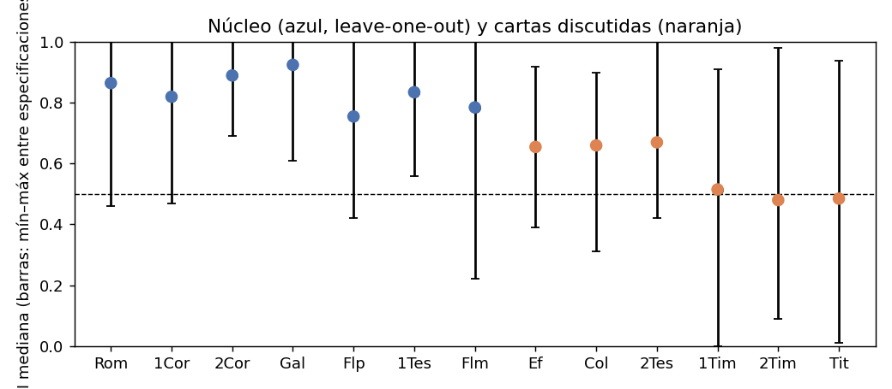

Panorama: GI mediana y rango por carta (fig_overview.png)

*0.3 Calibración por especificación (calibration_by_spec.csv)*

AUC 0,883-0,982 (mediana 0,957); c@1 0,907-0,972; FPR@0,5 0,055-0,215; FNR@0,5 0,012-0,325. Ventana 500: AUC 0,883-0,953; documento entero: 0,960-0,982 (conserva la longitud, que es en sí una pista). Sin diferencia por diacríticos. **Calibración secundaria** (calibracion_secundaria_cristiana.csv): con los negativos restringidos a textos cristianos, AUC 0,811-0,974 y FPR@0,5 0,08-0,45: el método distingue mucho mejor «Pablo» de «prosa pagana» que «Pablo» de «otra carta cristiana». Los negativos cristianos con GI más alto frente al núcleo son 1 Pedro (mediana 0,73), Ps-Ignacio a los de Tarso (0,65), Ignacio a los Efesios (0,63), 3 Juan (0,63) y 2 Pedro (0,62). **Toda lectura de las cartas discutidas debe hacerse con esta escala:** ni siquiera las cartas del núcleo superan «apoyo moderado» a la misma mano.

*0.4 Pseudoepigrafías conocidas (gi_results_all_specs.csv, kind = pseudepigraphy; medianas)*

Ps-Clemente a Santiago 0,09; Pedro a Santiago 0,10; María a Ignacio 0,12; Ignacio a María 0,16; a los Filipenses 0,18; *De fato* 0,26; a Herón 0,43; a los de Tarso 0,44; 2 Clemente 0,44; *De liberis educandis* 0,57; **3 Corintios 0,58**; **Ps-Ignacio a los Antioquenos 0,75**. Nueve de doce por debajo de 0,5. Las tres que pasan son las que imitan el registro del autor imitado: el método tiene un límite frente al imitador competente, y ese límite está en la zona 0,55-0,75. Las siete cartas interpoladas de Ignacio (texto genuino con adiciones) puntúan 0,50-1,00: la interpolación no se detecta.

*0.5 Variación intra-autor de los controles (pair_distances_minmax.csv)*

Distancias entre obras distintas de un mismo autor de control (documentos genuine, ventanas de 500 tokens, min-max): 1.034 pares, mínimo 0,533, cuartiles 0,609 / 0,647 / 0,703, máximo 0,812 (Juliano, cartas 7 y 23); la envolvente del ledger usa 385 de ellos (tope de 120 por autor). Las cartas paulinas están a 0,594-0,667 del núcleo. Pares de controles con distancia como la de Tito (0,667): cartas 6 y 47 de Juliano (0,655), 56 y 69 (0,655), 21 y 51 (0,656), carta 5 de Isócrates frente a su *Panegírico* (0,658); como la de Colosenses (0,638): *Guerra* 5 frente a *Antigüedades* 1 de Josefo (0,627), cartas 1 y 2 de Isócrates (0,627); como la de Efesios (0,621): *Guerra* 2 frente a *Antigüedades* 13 (0,609), *De curiositate* frente a *Conjugalia praecepta* de Plutarco (0,609); como la de 2 Tesalonicenses (0,594): carta 6 de Isócrates frente a *Nicocles* (0,582), *Vida* frente a *Antigüedades* 20 de Josefo (0,583), *Anábasis* 4 frente a *Índica* de Arriano (0,585).

*0.6 Ruido de edición (edition_noise_pairs.csv)*

Misma carta de Ignacio en dos ediciones: 0,015-0,056 (min-max); 1 Clemente: 0,026. Las diferencias entre cartas paulinas están un orden de magnitud por encima. Las tres ediciones del NT dan el mismo cuadro (campaña 02b).

*0.7 Variables no autorales dentro del corpus (permanova_pauline_windows.csv, dbrda_partition_pauline_windows.csv)*

Ventanas de 400 tokens de las 13 cartas (n = 76): identidad de carta R² = 0,26; núcleo/discutidas 0,07; registro litúrgico 0,078, polémica 0,073, co-remitentes 0,052, cautividad 0,042, destinatario 0,037, orden eclesial 0,029 (todas p = 0,002); modelo conjunto de situación R² = 0,235 (R² únicos: polémica 0,049, co-remitentes 0,035, registro 0,035; el resto colineal). Advertencia: dentro del corpus las variables están confundidas con la partición autoral (las Pastorales son todas «a individuo, sin co-remitente, con orden eclesial»); esto es una cota, no una atribución.

*0.8 Heterogeneidad interna del núcleo (rolling_scores.csv, mfw:300)*

Romanos 1,13-3,1 y 8,38-9,23, 1 Corintios 7 y 12-14 puntúan 0,42-0,48 en ventanas de 400 tokens. Un tramo con GI ≈ 0,45 es paulino en cartas indiscutidas.

***Capítulos por epístola***

Convenciones: GI = mediana entre las 48 especificaciones (Q1-Q3; mín-máx); «familias» = GI mediana con mfw:300 / closed:150 / char3:600; «máscara» = GI sin / con enmascarado de fórmulas, material preformado y citas del AT; LR = log10 de la razón de verosimilitud calibrada, principal / cristiana; percentil = posición de la distancia media al núcleo entre las distancias intra-autor de los controles, min-max / Delta (y entre los pares del propio núcleo); rasgos = formas con mayor \|z\| respecto de la dispersión del núcleo (feature_contributions.csv); persona = ‰ de yo / nosotros / tú / vosotros (descriptives.csv). Posteriores bajo priors 0,2 / 0,5 / 0,8: solo capa estilométrica, con la LR mediana principal (y entre paréntesis, con la cristiana); el prior es una elección del lector.

*1. Romanos (Rom)*

**1.1 Ficha.** 7.055 tokens; sin co-remitentes; Tercio como escritor material (16,22); a una comunidad no fundada por Pablo; sin cautividad; polémica 1, diatriba 3, registro litúrgico 1; citas del AT: 66 versículos enmascarables; fecha 56-57. Hipótesis aplicables: H1-H3 (carta de referencia).

**1.2 Resultado estilométrico.** GI 0,87 (0,69-0,99; 0,46-1,00); 98 % de especificaciones ≥ 0,5. LR 0,86 (0,51-1,69) / 0,60: apoyo débil-moderado a «misma mano que el resto del núcleo». Familias 0,91 / 0,83 / 0,83; máscara 0,84 / 0,88 (enmascarar las 66 citas del AT y Rom 1,3-4; 3,24-26; 4,25 sube la puntuación). Posteriores: 0,64 / 0,88 / 0,97 (0,50 / 0,80 / 0,94).

**1.3 Mismo rasero.** Distancia 0,626; percentil 59 / 6; entre pares del núcleo 57 / 43. Una distancia como esta es corriente entre obras de un mismo autor de control (Josefo, *Guerra* 2 frente a *Antigüedades* 13, 0,609; Plutarco, *De curiositate* frente a *Conjugalia praecepta*, 0,609).

**1.4 Heterogeneidad interna.** 67 ventanas; mediana 0,70; cuatro por debajo de 0,5: 1,13-3,1 (diatriba contra judíos y gentiles, 0,43-0,48) y 8,38-9,23 (0,48); máximo 5,15-6,17 (0,95). El capítulo 16 no destaca (0,55-0,80 en sus ventanas).

**1.5 Rasgos que separan.** Ninguna forma con \|z\| \> 3; la carta define el centroide.

**1.6 Derrotadores.** Escriba nombrado (el «estilo de Romanos» incluye a Tercio); diatriba (registro oral-argumentativo que no comparten Ef, Col, Pastorales); longitud (la mayor del corpus: ventana entera muy favorable, 0,98-0,99); posible carácter compuesto del cap. 16 (no detectado por el rolling).

**1.7 Capas no estilométricas.** Marción: contenida en el Apostolikon según la tradición crítica (de *Adv. Marc.* V solo se ha cotejado aquí el pasaje sobre Efesios/Laodicenses, E-4; el resto queda pendiente). Muratori: séptima de las siete iglesias (E-3). P46: conservada (E-6). Peso: a favor, independiente del estilo.

**1.8 Hipótesis.** Referencia del núcleo: H1-H3 por definición; el estilo no separa dictado de redacción personal.

**1.9 Conclusión indicativa.** Romanos es la carta que fija el patrón y lo es también en la práctica: se reconoce en el 98 % de las especificaciones y su distancia al resto del núcleo está en la mediana de lo que hacen los autores de control. Su heterogeneidad interna (diatriba de 1-3) marca el suelo de lo que en Pablo es normal.

**1.10 Qué haría falta.** Nada específico; sirve de referencia.

*2. 1 Corintios (1Cor)*

**2.1 Ficha.** 6.812 tokens; co-remitente Sóstenes; saludo autógrafo 16,21; comunidad fundada; polémica 2, diatriba 2, registro litúrgico 1; 17 versículos con citas del AT; 11,23-25 y 15,3-7 recibidos (παρέλαβον); 14,34-35 discutido como interpolación; fecha 54-55. H1-H3.

**2.2 Resultado.** GI 0,82 (0,63-0,99; 0,47-1,00); 94 % ≥ 0,5. LR 0,81 (0,42-1,72) / 0,55. Familias 0,84 / 0,82 / 0,76; máscara 0,83 / 0,82. Posteriores 0,62 / 0,87 / 0,96 (0,47 / 0,78 / 0,93).

**2.3 Mismo rasero.** 0,638; percentil 66 / 19; pares del núcleo 76 / 81: es, tras Tito, la carta que más se aleja de las demás, a la misma distancia que Colosenses (0,638). Pares de control equivalentes: Josefo, *Guerra* 5 frente a *Antigüedades* 1 (0,627); Isócrates, cartas 1 y 2 (0,627).

**2.4 Heterogeneidad.** 65 ventanas; mediana 0,63 (la más baja del núcleo); nueve por debajo de 0,5, en 3,2-6,19, 7,5-8,6 (matrimonio y virginidad) y 12,10-14,10 (carismas); máximo 10,30-11,23 (0,85). 14,34-35 cae dentro de un tramo bajo, pero el tramo entero (12-14) lo es.

**2.5 Rasgos.** Sin formas con \|z\| \> 3.

**2.6 Derrotadores.** Respuestas a una carta (registro de *quaestiones*); co-remitente; tramos de tratado (12-15); citas del AT.

**2.7 Capas no estilométricas.** Marción (tradición crítica; no cotejado), Muratori (primera de las siete iglesias, E-3), P46 (E-6): a favor.

**2.8-2.9.** Referencia del núcleo. Lo notable es que la carta indiscutida más larga después de Romanos tenga un tercio de sus ventanas por debajo de 0,65 y la distancia al resto del núcleo más alta después de Tito: la variación interna de Pablo es grande.

**2.10.** Sin necesidades específicas.

*3. 2 Corintios (2Cor)*

**3.1 Ficha.** 4.473 tokens; co-remitente Timoteo; comunidad fundada; polémica 3 (la más aguda), diatriba 1, litúrgico 1 (eulogía 1,3-11); 9 versículos con citas del AT; posible compilación de varias cartas (10-13; 6,14-7,1); fecha 55-56. H1-H3.

**3.2 Resultado.** GI 0,89 (0,79-1,00; 0,69-1,00); 100 % ≥ 0,5. LR 1,11 (0,87-1,71) / 1,03: apoyo moderado. Familias 0,92 / 0,87 / 0,92; máscara 0,92 / 0,87. Posteriores 0,76 / 0,93 / 0,98 (0,73 / 0,91 / 0,98).

**3.3 Mismo rasero.** 0,598; percentil 25 / 2; pares del núcleo 19 / 24: la más próxima al resto del núcleo junto con 2 Tesalonicenses (0,594).

**3.4 Heterogeneidad.** 41 ventanas, mediana 0,82, ninguna por debajo de 0,5; mínimo 9,9-10,16 (0,67), en la transición a los capítulos 10-13; máximo 1,1-1,19 (0,95). La hipótesis de compilación no deja huella estilométrica: las partes supuestas son del mismo estilo.

**3.5 Rasgos.** Sin formas con \|z\| \> 3.

**3.6 Derrotadores.** Polémica aguda y persona (yo 24 ‰, vosotros 34 ‰: los rasgos de persona se excluyen, pero el registro apologético permanece); co-remitente.

**3.7 Capas.** Marción (tradición crítica; no cotejado), Muratori (con 1 Cor, E-3), P46 (E-6): a favor.

**3.8-3.9.** Referencia. La carta más reconocida junto con Gálatas: 2 Corintios es «el Pablo más paulino» del corpus a efectos del método, precisamente la carta de la polémica y la apología.

*4. Gálatas (Gal)*

**4.1 Ficha.** 2.226 tokens; «todos los hermanos que están conmigo» como co-remitentes; autógrafo 6,11 («letras grandes»); sin acción de gracias; polémica 3, diatriba 2; 10 versículos con citas del AT; fecha 48-55. H1-H3.

**4.2 Resultado.** GI 0,92 (0,74-1,00; 0,61-1,00); 100 % ≥ 0,5. LR 1,34 (0,78-1,74) / 1,39: apoyo moderado (el mayor del corpus). Familias 0,93 / 0,89 / 0,91; máscara 0,92 / 0,93. Posteriores 0,85 / 0,96 / 0,99 (0,86 / 0,96 / 0,99).

**4.3 Mismo rasero.** 0,619; percentil 52 / 16; pares del núcleo 48 / 76.

**4.4 Heterogeneidad.** 19 ventanas, mediana 0,72, ninguna \< 0,5; mínimo 3,11-4,7 (0,55: la argumentación escriturística sobre Abrahán y la Ley), máximo 2,9-3,11 (0,83).

**4.5 Rasgos.** Sin formas con \|z\| \> 3.

**4.6 Derrotadores.** Polémica; citas del AT concentradas en 3-4.

**4.7 Capas.** Marción (según la tradición crítica; no cotejado aquí), Muratori (quinta, E-3), P46 (E-6): a favor.

**4.8-4.9.** Referencia: la carta más segura del método, con LR moderada bajo las dos calibraciones.

*5. Filipenses (Flp)*

**5.1 Ficha.** 1.626 tokens; co-remitente Timoteo; comunidad fundada; cautividad; polémica 1 (cap. 3); registro litúrgico 2 (himno 2,6-11); sin citas del AT; posible compilación; fecha 55-62. H1-H3.

**5.2 Resultado.** GI 0,76 (0,60-0,94; 0,42-1,00); 88 % ≥ 0,5: **la carta del núcleo peor reconocida**. LR 0,65 (0,38-1,04) / 0,33: apoyo débil. Familias 0,79 / 0,69 / 0,82; máscara 0,76 / 0,70 (el himno enmascarado no la acerca). Posteriores 0,53 / 0,82 / 0,95 (0,35 / 0,68 / 0,89).

**5.3 Mismo rasero.** 0,604; percentil 32 / 3; pares del núcleo 33 / 29: próxima al resto del núcleo en distancia media, aunque el GI sea el más bajo (el GI depende del impostor más cercano, la distancia no).

**5.4 Heterogeneidad.** 13 ventanas, mediana 0,78, ninguna \< 0,5; mínimo 3,11-4,15 (0,50), máximo 1,1-1,25 (1,00).

**5.5 Rasgos.** ὅσα, ζῆν, μέχρι, ἤδη, ὄνομα (+2,3-2,4); τοῦ (−2,3), μή, γάρ (−1,8-1,9): déficit de partículas argumentativas, como en Ef y Col, pero más suave.

**5.6 Derrotadores.** Cautividad y tono de amistad (menos argumentación); himno; carta relativamente breve; co-remitente.

**5.7 Capas.** Marción (tradición crítica; no cotejado), Muratori (tercera, E-3), P46 (E-6): a favor.

**5.8-5.9.** Referencia con lección: **la carta indiscutida de cautividad, con himno y sin polémica sostenida, es la que más se parece por comportamiento a Efesios y Colosenses** (GI 0,76 frente a 0,66; percentil 32 frente a 54 y 67; mismo perfil de rasgos: menos γάρ, menos partículas). Filipenses marca hasta dónde llega Pablo cuando cambia de registro.

**5.10.** Más controles de cartas de cautividad y amistad de autores seguros (Cicerón no sirve: latín).

*6. 1 Tesalonicenses (1Tes)*

**6.1 Ficha.** 1.473 tokens; co-remitentes Silvano y Timoteo; «nosotros» dominante (nosotros 33 ‰, yo 1 ‰); comunidad fundada; sin polémica ni diatriba; sin citas del AT; 2,14-16 discutido como interpolación; fecha 50-51. H1-H3.

**6.2 Resultado.** GI 0,84 (0,70-0,96; 0,56-1,00); 100 % ≥ 0,5. LR 0,76 (0,57-1,38) / 0,55. Familias 0,80 / 0,83 / 0,92; máscara 0,84 / 0,82. Posteriores 0,59 / 0,85 / 0,96 (0,47 / 0,78 / 0,93).

**6.3 Mismo rasero.** 0,613; percentil 45 / 6; pares del núcleo 48 / 43.

**6.4 Heterogeneidad.** Por debajo de la longitud mínima del rolling (1.500 tokens).

**6.5 Rasgos.** Sin formas con \|z\| \> 3.

**6.6 Derrotadores.** Co-remitencia real («nosotros»: la persona se excluye, pero la sintaxis del plural no); brevedad.

**6.7 Capas.** Marción (tradición crítica; no cotejado), Muratori (sexta, con 2 Tes, E-3), P46 (E-6): a favor.

**6.8-6.9.** Referencia. La carta «en nosotros» se reconoce tan bien como las de «yo»: la co-remitencia no borra la mano. Esto importa para 2 Tesalonicenses.

*7. Filemón (Flm)*

**7.1 Ficha.** 334 tokens (la más breve; con máscara, 201); co-remitente Timoteo; autógrafo v. 19; a un individuo y su iglesia doméstica; cautividad; sin polémica; sin citas; fecha 55-62. H1-H3.

**7.2 Resultado.** GI 0,78 (0,67-0,90; 0,22-1,00); 94 % ≥ 0,5. LR 0,76 (0,46-1,07) / 0,52. Familias 0,76 / 0,71 / 0,91; máscara 0,83 / 0,76. Posteriores 0,59 / 0,85 / 0,96 (0,45 / 0,77 / 0,93).

**7.3 Mismo rasero.** 0,619; percentil 53 / 7; pares del núcleo 48 / 43.

**7.4-7.5.** Sin rolling (longitud); sin rasgos con \|z\| \> 2,5 (a 334 tokens ninguna frecuencia es significativa).

**7.6 Derrotadores.** Longitud extrema: el intervalo 0,22-1,00 entre especificaciones lo dice todo; es el control interno de lo que el método puede decir de un texto de 300-700 tokens (Tito, 2 Tes).

**7.7 Capas.** Marción (Tertuliano, *Adv. Marc.* V, 21, pendiente de cotejo, E-5); Muratori («una a Filemón», E-3); ausente de las hojas conservadas de P46 (E-6): a favor la recepción; neutra la papirología.

**7.8-7.9.** Referencia. Que una carta de 334 tokens a un individuo se reconozca en el 94 % de las especificaciones es la mejor noticia del método para las cartas breves; que su GI oscile entre 0,22 y 1,00 es la advertencia.

**7.10.** Más iteraciones y más impostores breves del s. I-II para estabilizar las cartas cortas.

*8. Efesios (Ef)*

**8.1 Ficha.** 2.416 tokens (1.559 con máscara: la eulogía 1,3-14 y la oración 1,15-23, el fragmento hímnico 5,14, el código doméstico 5,21-6,9 y seis versículos con citas del AT suman el 35 %); sin co-remitentes ni nota autógrafa; carta circular (la mención de Éfeso en 1,1 es textualmente discutida; no cotejada aquí); sin polémica ni diatriba; registro litúrgico 3; código doméstico; cautividad (3,1; 4,1); dependencia literaria de Colosenses; frase media (editorial) 29 palabras, la más larga del corpus; fecha 60-62 si auténtica, 80-95 si pseudónima. H1-H5.

**8.2 Resultado estilométrico.** GI 0,66 (0,59-0,75; 0,39-0,92); 81 % de especificaciones ≥ 0,5; **por debajo de todas las cartas del núcleo** (la más baja, Flp, 0,76) y dentro del rango del núcleo en el 52 % de las especificaciones. LR 0,39 (0,19-0,52) / 0,07 (−0,14-0,24): apoyo débil con la calibración principal, **no discriminante** con negativos cristianos; Efesios está en el percentil 93 de los negativos cristianos, es decir, se parece al núcleo más que el 93 % de las cartas cristianas que no son de Pablo, pero también 1 Pedro (0,73), Ignacio a los Efesios (0,63) y 3 Juan (0,63) están ahí. Familias 0,71 / 0,53 / 0,70: estable; máscara 0,65 / 0,66: enmascarar la eulogía y el código no la acerca ni la aleja. Robustez (02a-e): 0,31-0,84 según el núcleo (con Col como candidata sube a 0,79-0,84: dependencia literaria; con las *Hauptbriefe* baja a 0,31-0,44, como baja el propio núcleo), 0,58-0,76 por edición (mfw y char3), 0,49-0,74 con ventana 300, 0,54-0,81 por rasgos; solo la clase cerrada la deja por debajo de 0,5 (0,40-0,56). Posteriores 0,38 / 0,71 / 0,91 (0,23 / 0,54 / 0,82). Figuras: fig_Ef_speccurve.png, fig_Ef_calibration.png, fig_Ef_rolling.png.

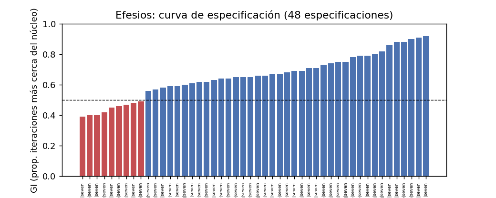

Curva de especificación de Ef (fig_Ef_speccurve.png)

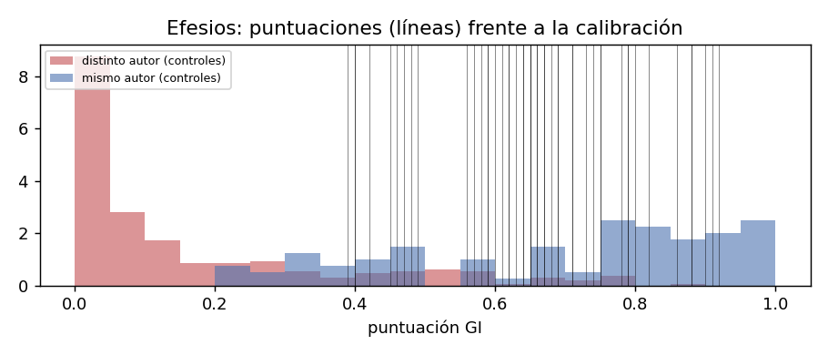

Posición de Ef respecto de las densidades de calibración (fig_Ef_calibration.png)

**8.3 Mismo rasero.** Distancia 0,621; percentil 54 / 3; pares del núcleo 57 / 24. Una distancia como esta es corriente entre obras de un mismo autor de control; en concreto, es la de Romanos respecto del resto del núcleo (0,626), la de *Guerra* 2 frente a *Antigüedades* 13 de Josefo (0,609), la de *De curiositate* frente a *Conjugalia praecepta* de Plutarco (0,609). Con Delta, Efesios está **más cerca** del núcleo que cualquier carta del núcleo salvo 2 Cor (percentil 3).

**8.4 Heterogeneidad interna.** 21 ventanas, mediana 0,70, ninguna \< 0,5; mínimo 1,7-2,6 (0,50: la eulogía y la oración, material litúrgico), máximo 5,19-6,12 (0,83: la parénesis y el código doméstico, contra la expectativa de que el código fuera lo «menos paulino»). Homogénea.

**8.5 Rasgos que separan.** πάσης (+8,3), γῆς (+6,9), πατέρα (+6,1), τοῖς (+6,0), ᾧ (+5,7), αὐτοῦ (+5,6: 24,6 ‰ frente a 6,1 ‰), ἧς (+5,1), τούτου (+4,9), τήν (+4,4), τῆς (+4,1), τοῦ (+3,4), πάντων (+3,3), αὐτῷ (+2,9); en defecto, ἀλλά (−2,9: 7,5 ‰ frente a 14,5 ‰) y γάρ (−2,8: 8,2 ‰ frente a 27,7 ‰). Clasificación: artículos y relativos (función-sintaxis), pronombre de 3.ª persona referido a Cristo y a Dios (función con carga temática), «todo/toda» (léxico del pleroma), «tierra», «padre» (contenido). **Predominantemente funcional-sintáctica**: cadenas de genitivos y relativos, y déficit de partículas argumentativas. Es la gramática del himno y de la oración, no un vocabulario nuevo.

**8.6 Derrotadores.** (1) Registro litúrgico-epidíctico (el 35 % del texto es material formular o tradicional; la frase media de 29 palabras es editorial, pero la sintaxis encadenada no); (2) dependencia literaria de Colosenses (con Col como candidata el GI sube de 0,58-0,71 a 0,79-0,84); (3) carta circular sin noticias personales: ausencia de la situación concreta que en las demás cartas produce la variación «paulina»; (4) cautividad y ausencia de polémica: Filipenses, el control interno más parecido, es también la carta del núcleo con GI más bajo; (5) el límite del método frente al imitador competente (3 Cor 0,58; Ps-Ignacio a los Antioquenos 0,75): un GI de 0,66 es compatible con un imitador del registro; (6) confusión de variables: liturgical_register explica por sí sola el 7,8 % de la variación entre ventanas del corpus.

**8.7 Capas no estilométricas.**

  --------------------------------------------------------------------------------------------------------------------------------------------------------------------------------------------------------------------------------------------------------------------------------------------------
  capa                    evidencia                                                                 fuente                                                   peso                                                                                                         independiente del estilo
  ----------------------- ------------------------------------------------------------------------- -------------------------------------------------------- ------------------------------------------------------------------------------------------------------------ --------------------------
  recepción               Marción la incluía en su Apostolikon bajo el título «a los Laodicenses»   Tertuliano, *Adv. Marc.* V, 11, 12 (E-4)                 a favor de la antigüedad y de la circulación bajo el nombre de Pablo antes de 140; neutro entre H1 y H2-H4   sí

  recepción               Muratori: «to the Ephesians second»                                       E-3                                                      a favor (c. 170-200)                                                                                         sí

  papirología             conservada en P46 (c. 200)                                                E-6                                                      a favor de la pertenencia temprana al corpus                                                                 sí

  crítica textual         ausencia de ἐν Ἐφέσῳ en 1,1 en testigos antiguos                          no cotejada en esta campaña                              pendiente                                                                                                    ---

  dependencia literaria   Ef reelabora Col (o a la inversa)                                         tratada en el software (exclusión de la carta hermana)   neutro: compatible con la misma mano en dos momentos, con un secretario y con un imitador                    no
  --------------------------------------------------------------------------------------------------------------------------------------------------------------------------------------------------------------------------------------------------------------------------------------------------

**8.8 Distribución de plausibilidad.**

  -----------------------------------------------------------------------------------------------------------------------------------------------------------------------------------------------------------------------------------------------------------------------------
  hipótesis                                  apoyo estilométrico                                                                                     apoyo no estilométrico                                             plausibilidad global (verbal)
  ------------------------------------------ ------------------------------------------------------------------------------------------------------- ------------------------------------------------------------------ -------------------------------------------------------
  H1 redacción personal de Pablo             GI 0,66, LR no discriminante, percentil 54: no excluida; por debajo del núcleo                          recepción y papirología a favor de la antigüedad, no de la mano    posible; no favorecida ni desfavorecida por el estilo

  H2 secretario/coautor limitado             compatible: desviaciones funcionales (relativos, partículas) del tipo que un amanuense produce          ninguna evidencia directa (sin nota autógrafa)                     plausible

  H3 composición delegada en vida de Pablo   compatible; indistinguible de H2 y H4 por estilo                                                        la circulación bajo su nombre antes de 140 no distingue H3 de H4   plausible

  H4 escuela paulina posterior               compatible (GI en la zona de otras cartas cristianas)                                                   dependencia de Col en cualquier dirección                          plausible

  H5 pseudonimia ajena al círculo            menos compatible: Ef no se aleja en rasgos de contenido (mfw 0,71, char3 0,70) y comparte el registro   recepción temprana como paulina                                    poco plausible por estilo, no excluida
  -----------------------------------------------------------------------------------------------------------------------------------------------------------------------------------------------------------------------------------------------------------------------------

**8.9 Conclusión indicativa.** Bajo el protocolo sellado, Efesios se parece al núcleo paulino más que a los impostores en cuatro de cada cinco especificaciones, pero menos que cualquier carta indiscutida, y su distancia al núcleo es la que Romanos guarda con el resto. Lo que la separa es la sintaxis del himno y de la oración (relativos, genitivos, «todo», tercera persona) y la falta de γάρ y ἀλλά, no un vocabulario ajeno; son los mismos rasgos, en grado mayor, que separan a Filipenses. No puede descartarse la autoría paulina por razones estilométricas; la decisión depende de las capas no estilométricas, que sitúan la carta bajo el nombre de Pablo antes de 140 (Marción) y en P46, sin decidir entre su mano, la de un secretario o la de un discípulo. El estilo desfavorece solo H5.

**8.10 Qué haría falta.** Controles de cartas circulares y litúrgicas de autores seguros (escasos en griego); un análisis explícito de reutilización Ef↔Col con alineamiento de pasajes; cotejo de 1,1 en NA28; más impostores cristianos del s. I-II (TLG) para afinar la calibración secundaria.

*9. Colosenses (Col)*

**9.1 Ficha.** 1.580 tokens (910 con máscara: himno 1,15-20, código 3,18-4,1, apertura, acción de gracias 1,3-14 y cierre 4,7-18 suman el 42 %); co-remitente Timoteo; autógrafo 4,18; comunidad no fundada por Pablo (Epafras); cautividad; polémica 2 (la «filosofía», 2,8-23); registro litúrgico 3; código doméstico; sin citas del AT; fecha 57-62 / 65-85. H1-H5.

**9.2 Resultado.** GI 0,66 (0,55-0,75; 0,31-0,90); 85 % ≥ 0,5; por debajo de todo el núcleo; dentro de su rango en el 54 %. LR 0,37 (0,10-0,53) / 0,06 (−0,19-0,28): débil / **no discriminante**; percentil 93 entre los negativos cristianos. Familias 0,71 / 0,52 / 0,71: estable; máscara 0,66 / 0,67. Robustez: 0,36-0,86 (0,36-0,43 con las *Hauptbriefe*; 0,86 con Ef como candidata en seven_plus); por edición 0,55-0,71; ventana 300 0,48-0,59; rasgos 0,52-0,75; clase cerrada 0,36-0,55. Posteriores 0,37 / 0,70 / 0,90 (0,23 / 0,54 / 0,82).

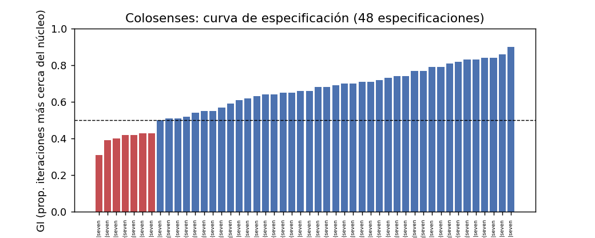

Curva de especificación de Col (fig_Col_speccurve.png)

Posición de Col respecto de las densidades de calibración (fig_Col_calibration.png)

**9.3 Mismo rasero.** 0,638; percentil 67 / 7; pares del núcleo 76 / 43: exactamente la distancia de 1 Corintios al resto del núcleo (0,638). Pares de control equivalentes: Josefo, *Guerra* 5 frente a *Antigüedades* 1 (0,627); Isócrates, cartas 1 y 2 (0,627). Con Delta, percentil 7.

**9.4 Heterogeneidad.** 12 ventanas, mediana 0,56 (la más baja del rolling); tres \< 0,5: 1,12-2,4 (0,47), 2,10-3,13 (0,42) y 2,16-3,18 (0,37), es decir, la polémica contra la «filosofía» (2,8-23) y la parénesis 3,1-17; máximo 1,23-2,16 (0,72), que incluye la reelaboración del himno. El tramo polémico es el menos «paulino» en mfw:300: el inverso de lo que ocurre en 2 Corintios y Gálatas, donde la polémica es el registro más reconocible.

**9.5 Rasgos.** αὐτῷ (+8,7: 13,9 ‰ frente a 2,6 ‰), γῆς (+7,1), πᾶν (+5,8), ἧς (+5,3), τήν, τοῦ, τοῖς (+3,7-3,9), οὗ, ὅς, ὅ (+3,5-3,7), πάντα (+3,5: 18,5 ‰), αὐτοῦ (+3,4), ἐστιν (+3,2), πάσης (+3,2); en defecto ἀλλά (−4,0: 2,3 ‰ frente a 14,5 ‰). Mismo perfil que Efesios: relativos, «todo», tercera persona referida a Cristo, cópula; déficit de adversativa. **Predominantemente funcional-sintáctico**, con el léxico del himno y del «todo».

**9.6 Derrotadores.** (1) Material preformado: el 42 % del texto es himno, código o fórmula; (2) dependencia literaria con Efesios; (3) comunidad no fundada y polémica de tipo distinto (contra una enseñanza, no contra adversarios personales); (4) cautividad; (5) el autógrafo 4,18 y Timoteo como co-remitente son datos internos compatibles con H1-H3 que el estilo no valora; (6) límite frente al imitador competente; (7) 1.580 tokens.

**9.7 Capas.**

  --------------------------------------------------------------------------------------------------------------------------------------------------------------------------------------------------------------------------------------------------------------------------------------------
  capa          evidencia                                                                                                                        fuente              peso                                                                                                      independiente
  ------------- -------------------------------------------------------------------------------------------------------------------------------- ------------------- --------------------------------------------------------------------------------------------------------- ---------------
  recepción     Muratori: «to the Colossians fourth»                                                                                             E-3                 a favor                                                                                                   sí

  recepción     Marción: incluida según la tradición crítica                                                                                     no cotejado (E-5)   pendiente                                                                                                 ---

  papirología   conservada en P46                                                                                                                E-6                 a favor                                                                                                   sí

  interna       autógrafo 4,18; Timoteo co-remitente; nombres compartidos con Flm (Onésimo, Epafras, Aristarco, Marcos, Demas, Lucas, Arquipo)   texto (SBLGNT)      a favor de una situación común con Filemón (H1-H3) o de un imitador que la reproduce (H4-H5): no decide   sí
  --------------------------------------------------------------------------------------------------------------------------------------------------------------------------------------------------------------------------------------------------------------------------------------------

**9.8 Distribución.** Como Efesios: H1 no excluida por estilo (percentil 67, dentro de la envolvente; GI por debajo del núcleo); H2 y H3 plausibles y compatibles con las desviaciones funcionales; H4 plausible; H5 poco plausible por estilo (registro y contenido compartidos), no excluida.

**9.9 Conclusión.** Colosenses es, por estilo, gemela de Efesios: mismo GI, mismos rasgos, misma posición (por debajo del núcleo, por encima de los negativos, dentro de la envolvente intra-autor, a la distancia de 1 Corintios). Lo particular es su interior: el tramo polémico 2,8-3,17 es el menos paulino en palabras frecuentes, y el himno reelaborado el más paulino, lo que invierte la relación que Gálatas y 2 Corintios tienen con la polémica. No puede descartarse la autoría paulina por razones estilométricas; la decisión depende de las capas no estilométricas y del juicio sobre la relación con Filemón.

**9.10.** Análisis de reutilización Col↔Ef; controles de cartas con himnos incrustados (Ignacio Ef 19) y códigos; comparación de los nombres con Filemón mediante la onomástica del autor (E-7).

*10. 2 Tesalonicenses (2Tes)*

**10.1 Ficha.** 820 tokens (542 con máscara); co-remitentes Silvano y Timoteo; «nosotros» dominante (nosotros 30 ‰, yo 0); autógrafo 3,17 («marca de autenticidad»); comunidad fundada; polémica 1; sin citas del AT (1,5-10 material apocalíptico tradicional, consenso bajo); dependencia formal de 1 Tesalonicenses; fecha 51 / 80-100. H1-H5.

**10.2 Resultado.** GI 0,67 (0,59-0,81; 0,42-1,00); 94 % ≥ 0,5 (la mayor fracción de las seis); por debajo del núcleo; dentro de su rango en el 60 %. LR 0,38 (0,28-0,57) / 0,08 (−0,02-0,31): débil / **no discriminante**; percentil 95 entre negativos cristianos. **Con 1 Tesalonicenses como candidata** (variante target_sister): 0,91 (0,67-1,00): la proximidad a 1 Tes es de otro orden que la proximidad al resto del núcleo, y es la dependencia literaria, no una medida de mano; la cifra oficial la excluye. Familias 0,67 / 0,67 / 0,75: la más estable de las seis; máscara 0,67 / 0,67. Robustez: núcleo 0,33-0,63 (0,80-0,89 con 1 Tes y Col candidatas), edición 0,56-0,67, ventana 300 0,57-0,63, rasgos 0,53-0,74, clase cerrada 0,57-0,67 (la más alta de las seis en la medida más neutra). Posteriores 0,38 / 0,71 / 0,91 (0,23 / 0,55 / 0,83).

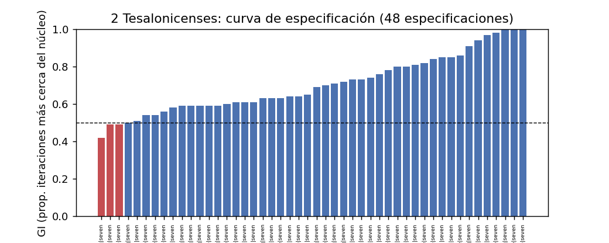

Curva de especificación de 2Tes (fig_2Tes_speccurve.png)

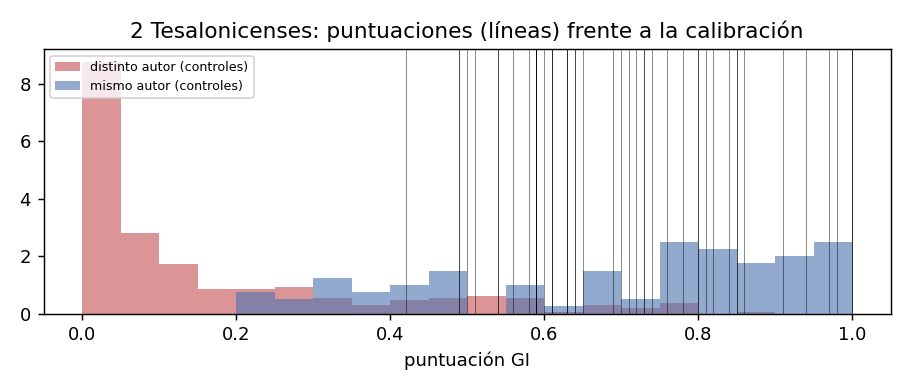

Posición de 2Tes respecto de las densidades de calibración (fig_2Tes_calibration.png)

**10.3 Mismo rasero.** 0,594; percentil 22 / 3; pares del núcleo 19 / 24: **la carta discutida más próxima al núcleo, tan próxima como 2 Corintios** (0,598). Pares de control equivalentes: Isócrates, carta 6 frente a *Nicocles* (0,582); Josefo, *Vida* frente a *Antigüedades* 20 (0,583); Arriano, *Anábasis* 4 frente a *Índica* (0,585).

**10.4 Heterogeneidad.** Por debajo de la longitud mínima del rolling.

**10.5 Rasgos.** κύριος (+6,2: 13 ‰ frente a 2,4 ‰), κυρίου (+4,1: 28 ‰), μήτε (+5,3), μηδέ (+3,1), αὐτούς (+4,6), ἀπό (+4,2), πάντων (+3,8), Ἰησοῦς (+2,8), παρά (+2,7), ἐφ' (+2,4); en defecto τά (−3,5: 0 ‰), τούς (−2,5: 0 ‰), γάρ (−2,4). **Mixto con predominio temático**: el léxico del «Señor» (escatología) y las negaciones coordinadas; la ausencia total de τά y τούς en 820 tokens es un dato de muestra pequeña.

**10.6 Derrotadores.** (1) 820 tokens: intervalo 0,42-1,00; (2) dependencia formal de 1 Tes (sin ella, GI 0,67; con ella, 0,91); (3) «nosotros» y co-remitentes; (4) tema escatológico concentrado (1,5-2,12); (5) el autógrafo 3,17 es un dato interno que el estilo no valora; (6) límite frente al imitador de una carta concreta: un imitador que copia 1 Tes produciría exactamente una proximidad alta a 1 Tes y media al resto (el patrón observado), pero también lo produce Pablo escribiendo poco después a la misma iglesia.

**10.7 Capas.**

  ---------------------------------------------------------------------------------------------------------------------------------------------------------------------------------------------------------------------------------------------------------
  capa          evidencia                                                                                                  fuente        peso                                                                                               independiente
  ------------- ---------------------------------------------------------------------------------------------------------- ------------- -------------------------------------------------------------------------------------------------- ---------------
  recepción     Muratori: «to the Thessalonians sixth» (las dos)                                                           E-3           a favor                                                                                            sí

  recepción     Marción: incluida según la tradición crítica                                                               no cotejado   pendiente                                                                                          ---

  papirología   P46: 1 Tes conservada en parte; 2 Tes en las hojas perdidas (debate sobre el contenido final del códice)   E-6           neutro                                                                                             sí

  interna       3,17 «saludo de mi mano... en toda carta»; 2,2 «carta como de nosotros»                                    texto         a favor de H1-H2 si es de Pablo; es el argumento clásico contra ella si es pseudónima: no decide   ---
  ---------------------------------------------------------------------------------------------------------------------------------------------------------------------------------------------------------------------------------------------------------

**10.8 Distribución.** H1 no excluida y, en la medida más neutra (clase cerrada), la mejor situada de las seis; H2-H3 plausibles (co-remitencia real, como en 1 Tes, que se reconoce bien); H4 plausible (imitación de 1 Tes); H5 poco plausible por estilo. El estilo no separa «Pablo poco después de 1 Tes» de «imitador de 1 Tes».

**10.9 Conclusión.** 2 Tesalonicenses es la carta discutida que más se parece al núcleo por distancia (como 2 Corintios) y por clase cerrada, y la más estable entre especificaciones; su dependencia de 1 Tes se documenta (0,91 frente a 0,67) y se descuenta. No puede descartarse la autoría paulina por razones estilométricas; la única razón estilométrica que se le opone es la general: está por debajo del núcleo, como Efesios y Colosenses, con 820 tokens de texto.

**10.10.** Más iteraciones y controles de pares de cartas al mismo destinatario por un mismo autor (Juliano ofrece varios: cartas 45, 46 y 49 a Ecdicio, 52 y 53 a Libanio); análisis de reutilización 2 Tes→1 Tes.

*11. 1 Timoteo (1Tim)*

**11.1 Ficha.** 1.591 tokens (1.419 con máscara: dichos fieles 1,15; 3,1; 4,9; himno 3,16; doxología 6,15-16; cita 5,18); sin co-remitentes ni autógrafo; a un individuo colaborador; sin cautividad; polémica 2 (contra «algunos», τινες); registro litúrgico 1; orden eclesial 1; citas del AT muy bajas; riqueza léxica TTR 0,71 (núcleo 0,57-0,63); imperativos 27 ‰ (núcleo 5-15 ‰); fecha 63-66 / 100-130. H1-H5.

**11.2 Resultado.** GI 0,52 (0,26-0,73; 0,00-0,91); 52 % ≥ 0,5; por debajo del rango del núcleo en el 67 % de las especificaciones. LR 0,11 (−0,17-0,49) / −0,20 (−0,47-0,15): **no discriminante** en ambas calibraciones; percentil 80 entre negativos cristianos. **Familias 0,82 / 0,52 / 0,14**: el veredicto cambia de signo con la familia de rasgos, y la campaña 02d lo convierte en gradiente: mfw:500 0,76, mfw:300 0,82, mfw:100 0,67, clase cerrada 0,46-0,52, char4 0,19, char3 0,14 (min-max). Máscara 0,55 / 0,47. Robustez: por edición 0,70-0,82 (mfw), 0,43-0,48 (closed), 0,09-0,12 (char3); ventana 300 igual; núcleos: 0,12-0,14 en char3 con cualquier núcleo. Posteriores 0,24 / 0,56 / 0,84 (0,14 / 0,39 / 0,71). Figuras fig_1Tim_speccurve.png (la curva más bipartida del corpus), fig_1Tim_calibration.png, fig_1Tim_rolling.png.

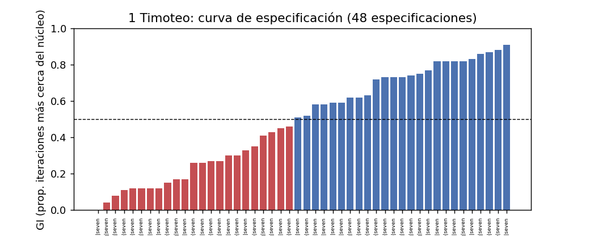

Curva de especificación de 1Tim (fig_1Tim_speccurve.png)

Posición de 1Tim respecto de las densidades de calibración (fig_1Tim_calibration.png)

**11.3 Mismo rasero.** 0,622; percentil 56 / 17; pares del núcleo 57 / 76. Una distancia como esta es corriente entre obras de un mismo autor de control; en concreto es la de Romanos (0,626) o Gálatas (0,619) respecto del resto del núcleo. **1 Timoteo no está más lejos del núcleo que Romanos**; lo que la distingue no es la distancia media sino la composición de esa distancia (véase 11.5) y el hecho de que, medida por caracteres, un impostor cualquiera queda más cerca del núcleo que ella.

**11.4 Heterogeneidad.** 12 ventanas (mfw:300), mediana 0,78, ninguna \< 0,5; mínimo 4,15-6,3 (0,50: las instrucciones a Timoteo, viudas, presbíteros, esclavos), máximo 1,1-2,8 (0,88). Homogénea; en la familia mfw es paulina de principio a fin.

**11.5 Rasgos.** τινες (+11,7: 8,2 ‰ frente a 0,4 ‰), πάσης (+8,2), καλῶς (+7,7), ἀνθρώπων (+7,5), πάντων (+6,1), ταῦτα (+6,0), πρῶτον (+5,6), δεῖ (+5,6), μηδέ (+5,6), λόγος (+5,5), μήτε (+4,3), εἶτα (+4,2), Ἰησοῦς (+3,8), τούτοις (+3,7), ὦ (+3,7). Clasificación: indefinidos y demostrativos (función: «algunos», «esto»), δεῖ y adverbios de orden (función de la instrucción), καλῶς, λόγος, ἀνθρώπων (léxico de la enseñanza). **Mixto**, con una firma gramatical clara: la de quien manda y ordena (δεῖ, πρῶτον, εἶτα, ταῦτα) y polemiza contra «algunos» sin nombrarlos. Los n-gramas de caracteres añaden lo que las formas no capturan: εὐσεβ-, σωφρ-, ὑγιαιν-, διδασκαλ-, -ία, -ικός (véase campana_02d).

**11.6 Derrotadores.** (1) Género: carta de mandato a un colaborador (*mandata principis*), sin paralelo en el núcleo salvo Filemón (334 tokens); Luciano, Filón y Epicteto pierden 0,4-0,6 puntos de GI cuando cambian de género (sesión 5 §7); (2) el vocabulario de la instrucción es de contenido, y la morfología léxica lo sigue; (3) desacuerdo entre familias: la señal no es robusta a la decisión de rasgos, luego no es una señal única sino dos (paulina en palabras frecuentes, ajena en morfología); (4) confusión: todas las variables de situación distinguen a las tres Pastorales del resto a la vez; (5) el registro doctrinal compartido acerca cualquier carta cristiana al núcleo en mfw; (6) 1.591 tokens.

**11.7 Capas.**

  ---------------------------------------------------------------------------------------------------------------------------------------------------------------------------------------------------------------------------------------------------------------------------------------------------------------------------------------------
  capa            evidencia                                                                                                                                          fuente                      peso                                                                                                                           independiente
  --------------- -------------------------------------------------------------------------------------------------------------------------------------------------- --------------------------- ------------------------------------------------------------------------------------------------------------------------------ ---------------
  recepción       Policarpo, *Fil.* 4,1 reproduce 1 Tim 6,10 y 6,7 casi literalmente («ἀρχὴ δὲ πάντων χαλεπῶν φιλαργυρία... οὐδὲν εἰσηνέγκαμεν εἰς τὸν κόσμον...»)   E-1 (textos del corpus)     a favor de la existencia de 1 Tim antes de c. 135 si la dependencia va de 1 Tim a Policarpo (la dirección no se decide aquí)   sí

  recepción       Ireneo cita 1 Tim 1,4 como «el apóstol» (I pref.)                                                                                                  E-2                         a favor de la atribución paulina c. 180                                                                                        sí

  recepción       Muratori: «two to Timothy»                                                                                                                         E-3                         a favor                                                                                                                        sí

  recepción       Marción: las Pastorales ausentes de su Apostolikon (Tertuliano, *Adv. Marc.* V, 21)                                                                E-5, **no cotejado**        pendiente; en su caso, neutro (exclusión doctrinal o desconocimiento)                                                          ---

  papirología     ausente de las hojas conservadas de P46; el debate sobre si cabía en las hojas perdidas está abierto (Nongbri 2022)                                E-6                         neutro                                                                                                                         sí

  prosopografía   nombres (Himeneo, Alejandro, etc.)                                                                                                                 expediente del autor, E-7   según ese expediente                                                                                                           ---
  ---------------------------------------------------------------------------------------------------------------------------------------------------------------------------------------------------------------------------------------------------------------------------------------------------------------------------------------------

**11.8 Distribución.** H1: no excluida por estilo (percentil 56, como Romanos); desfavorecida por la morfología léxica, favorecida por las palabras frecuentes: el estilo no decide. H2: plausible; un secretario con libertad explica bien la firma «δεῖ / εἶτα / τινες» sobre un fondo léxico paulino. H3: plausible e indistinguible de H2 y H4. H4: plausible; la recepción (Policarpo, Ireneo) sitúa la carta muy pronto y bajo el nombre de Pablo, lo que acota H4 a la primera generación. H5: poco plausible por estilo (mfw dentro del núcleo) y por recepción.

**11.9 Conclusión.** 1 Timoteo es paulina por palabras frecuentes, ajena por morfología y léxico propio, e indecisa por partículas; su distancia media al núcleo es la de Romanos. Es la carta cuyo resultado depende más de la decisión de rasgos, y por eso el informe no la resume en una cifra sino en el gradiente: comparte el registro doctrinal del núcleo y no comparte su morfología léxica. No puede descartarse la autoría paulina por razones estilométricas; la decisión depende de las capas no estilométricas, y el estilo solo desfavorece H5.

**11.10.** Controles de cartas de mandato a colaboradores por autores seguros (Juliano a Ecdicio, prefecto de Egipto: cartas 23, 45, 46 y 49, ya en el corpus, podrían aislarse como subconjunto); lematización uniforme (Diorisis) para separar morfología de léxico; más impostores cristianos.

*12. 2 Timoteo (2Tim)*

**12.1 Ficha.** 1.235 tokens (1.048 con máscara: dicho fiel/himno 2,11-13, cita 2,19); sin co-remitentes ni autógrafo; a un individuo colaborador; cautividad; polémica 2; carta testamentaria con abundantes noticias personales (yo 27 ‰, tú 16 ‰: persona excluida de los rasgos); TTR 0,69; imperativos 27 ‰; fecha 64-67 / 100-130. H1-H5.

**12.2 Resultado.** GI 0,48 (0,28-0,68; 0,09-0,98); 46 % ≥ 0,5; por debajo del rango del núcleo en el 75 %. LR 0,05 (−0,13-0,38) / −0,27 (−0,43-0,04): **no discriminante**; percentil 76 entre negativos cristianos. **Familias 0,72 / 0,41 / 0,23**; gradiente en 02d: mfw:500 0,74-0,84, mfw:300 0,62-0,72, mfw:100 0,54-0,67, clase cerrada 0,37-0,42, char4 0,17-0,32, char3 0,17-0,29. **Máscara 0,56 / 0,44**: es la carta a la que más afecta enmascarar (2,11-13 y 2,19 son 187 tokens). Posteriores 0,22 / 0,53 / 0,82 (0,12 / 0,35 / 0,68).

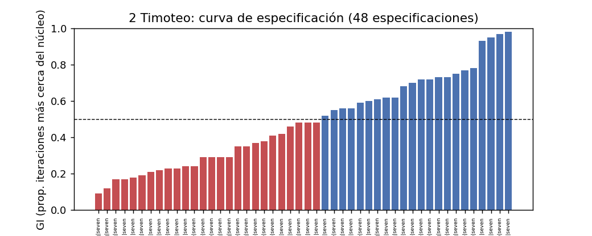

Curva de especificación de 2Tim (fig_2Tim_speccurve.png)

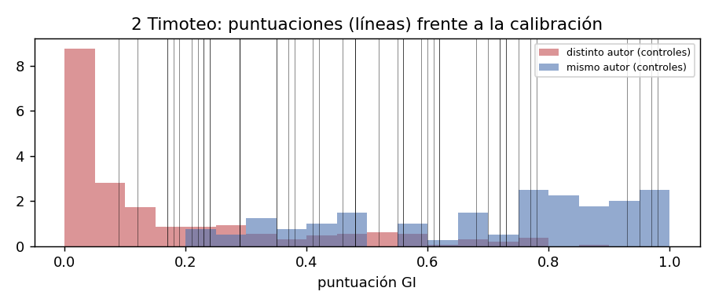

Posición de 2Tim respecto de las densidades de calibración (fig_2Tim_calibration.png)

**12.3 Mismo rasero.** 0,605; percentil 33 / 17; pares del núcleo 38 / 76: **más cerca del núcleo que Romanos, 1 Corintios, Gálatas, Filemón, Efesios y Colosenses** por distancia media (min-max); con Delta, percentil 17. Es la Pastoral más próxima al núcleo.

**12.4 Heterogeneidad.** 9 ventanas (mfw:300), mediana 0,72, ninguna \< 0,5; mínimo 1,11-2,21 (0,58), máximo 1,1-2,8 (0,85).

**12.5 Rasgos.** κύριος (+7,5: 14,8 ‰), ἔσται (+5,4), λόγος (+5,3), τάς (+5,2), ᾧ (+4,8), τήν (+4,5), παρά (+4,4), ἔργον (+4,2), τούτων (+3,7), ἐγένετο (+3,6), βασιλείαν (+3,5), δύναμιν (+3,4), πρῶτον (+3,3), ἀπό (+3,3), δεῖ (+3,3). **Mixto con más contenido** que 1 Tim (Señor, reino, poder, obra) y la misma gramática de la instrucción (δεῖ, πρῶτον); sin el τινες de 1 Tim.

**12.6 Derrotadores.** (1) La carta más personal del corpus fuera de Filemón: la exclusión de la persona gramatical deja intacta una sintaxis narrativa (ἐγένετο, ἔσται) que el núcleo no tiene; (2) cautividad y testamento (registro sin paralelo en el núcleo); (3) máscara: 187 tokens de material tradicional en 1.235; (4) gradiente de familias; (5) 1.235 tokens; (6) confusión de variables.

**12.7 Capas.**

  -------------------------------------------------------------------------------------------------------------------------------------------------------------------------------------
  capa            evidencia                                                                               fuente                      peso                              independiente
  --------------- --------------------------------------------------------------------------------------- --------------------------- --------------------------------- ---------------
  recepción       Ireneo: «Of this Linus, Paul makes mention in the Epistles to Timothy» (= 2 Tim 4,21)   E-2                         a favor de la atribución c. 180   sí

  recepción       Muratori: «two to Timothy»                                                              E-3                         a favor                           sí

  recepción       Marción: ausente                                                                        E-5, no cotejado            pendiente                         ---

  papirología     P46: ausente de las hojas conservadas; debate abierto                                   E-6                         neutro                            sí

  prosopografía   Onesíforo, Tíquico, Lucas, Marcos, Demas, Alejandro, Trófimo, Erasto...                 expediente del autor, E-7   según ese expediente              ---
  -------------------------------------------------------------------------------------------------------------------------------------------------------------------------------------

**12.8 Distribución.** H1: no excluida; por distancia media es la Pastoral mejor situada (percentil 33) y la tradición crítica de la «autenticidad de 2 Tim frente a 1 Tim y Tit» (Prior, Murphy-O'Connor, Johnson: no verificados en esta campaña, sección D) tiene aquí un correlato débil: 2 Tim está más cerca del núcleo que sus hermanas, pero en GI (0,48) no se distingue de ellas. H2-H4: plausibles. H5: poco plausible.

**12.9 Conclusión.** 2 Timoteo es la Pastoral más próxima al núcleo por distancia y la más lejana por GI en la mediana; la contradicción aparente se explica por el impostor más cercano (una carta cristiana de registro personal queda a menudo más cerca que el núcleo) y por la fuerte sensibilidad a la máscara. No puede descartarse la autoría paulina por razones estilométricas; la decisión depende de las capas no estilométricas.

**12.10.** Como 1 Tim; además, controles de cartas «testamentarias» y de despedida de autores seguros.

*13. Tito (Tit)*

**13.1 Ficha.** 659 tokens (452 con máscara: prescripto extenso 1,1-4, dicho fiel 3,4-8, cierre 3,12-15); sin co-remitentes ni autógrafo; a un individuo colaborador; sin cautividad; polémica 2 (1,10-16); orden eclesial 1; sin citas del AT; TTR 0,70; imperativos 21 ‰; frase media 20; la más breve de las Pastorales; fecha 63-66 / 100-130. H1-H5.

**13.2 Resultado.** GI 0,48 (0,11-0,63; 0,01-0,94); 50 % ≥ 0,5; por debajo del rango del núcleo en el 75 %. LR 0,07 (−0,50-0,29) / −0,26 (−0,73-−0,01): **no discriminante** (la Q1 cristiana, −0,73, es la más baja del corpus). **Familias 0,76 / 0,49 / 0,07**: la mayor divergencia del corpus; gradiente 02d: mfw:500 0,64-0,67, mfw:300 0,62-0,76, mfw:100 0,49-0,59, clase cerrada 0,42-0,53, char4 0,24-0,49, char3 0,04-0,18 (según edición). Máscara 0,51 / 0,45; sin diacríticos y con máscara, 0,40. Posteriores 0,23 / 0,54 / 0,82 (0,12 / 0,36 / 0,69).

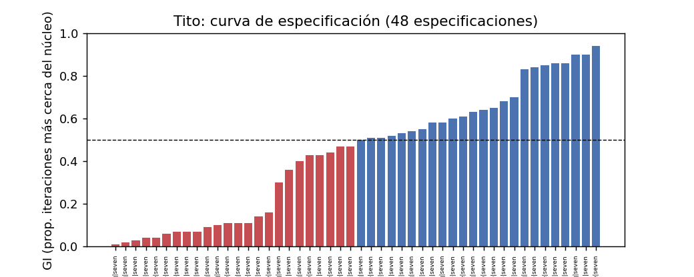

Curva de especificación de Tit (fig_Tit_speccurve.png)

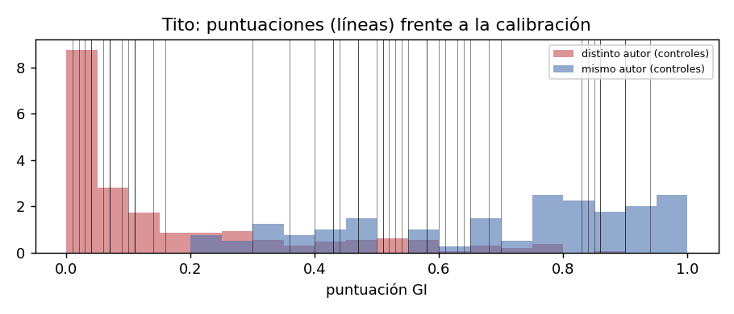

Posición de Tit respecto de las densidades de calibración (fig_Tit_calibration.png)

**13.3 Mismo rasero.** 0,667; **percentil 78 / 72; pares del núcleo 95 / 100**: la carta más alejada del núcleo de las trece, y la única cuya distancia supera la de cualquier par de cartas del núcleo entre sí. Aun así queda **dentro** de la envolvente intra-autor de los controles (regla ≤ 90): una distancia como esta es la que separa las cartas 6 y 47, 56 y 69, o 21 y 51 de Juliano (0,655-0,656), o la carta 5 de Isócrates de su *Panegírico* (0,658); el máximo intra-autor del corpus (0,81) lo dan dos cartas de Juliano. Declarar a Tito ajena a Pablo por esta distancia exigiría declarar ajenas a Juliano cartas suyas seguras.

**13.4 Heterogeneidad.** Por debajo de la longitud mínima del rolling.

**13.5 Rasgos.** εἶναι (+9,4: 19,9 ‰ frente a 2,3 ‰), δεῖ (+6,2: 9,9 ‰), τάς (+4,8), ἵνα (+4,8: 43 ‰ frente a 15 ‰), μή (+4,3: 43 ‰ frente a 18 ‰), πάσης (+4,2), λόγος (+4,0), θεοῦ (+3,9: 33 ‰), μηδέν (+3,9), πᾶν, πᾶσαν (+3,8), κατ' (+3,8), αὐτούς (+3,7), ἀνθρώποις (+3,7), ἅ (+3,7). **Predominantemente funcional-sintáctico**: infinitivo con δεῖ, finales con ἵνα, prohibiciones con μή, «todo». Es la gramática de la instrucción («que sean...», «para que...», «no...») en estado puro: ni una sola forma de contenido específico entre las quince primeras salvo λόγος, θεοῦ y ἀνθρώποις.

**13.6 Derrotadores.** (1) **659 tokens** (452 con máscara): el intervalo 0,01-0,94 y la Q1 de 0,11 son el efecto de la longitud (compárese Filemón, 334 tokens, 0,22-1,00); (2) género de mandato en su forma más concentrada (listas de cualidades para presbíteros, ancianos, jóvenes, esclavos); (3) gradiente de familias extremo; (4) prescripto de 65 palabras (1,1-4) enmascarable; (5) confusión de variables; (6) percentil entre pares del núcleo 95-100: es un hecho, no un derrotador, pero se lee con (1).

**13.7 Capas.**

  ------------------------------------------------------------------------------------------------------------------------------------------------------------------------------------------------------------------------
  capa            evidencia                                                                                                                  fuente                      peso                              independiente
  --------------- -------------------------------------------------------------------------------------------------------------------------- --------------------------- --------------------------------- ---------------
  recepción       Ireneo, *Adv. haer.* III, 3, 4 cita Tit 3,10 («A man that is an heretic, after the first and second admonition, reject»)   E-2                         a favor de la atribución c. 180   sí

  recepción       Muratori: «one to Titus»                                                                                                   E-3                         a favor                           sí

  recepción       Marción: ausente                                                                                                           E-5, no cotejado            pendiente                         ---

  papirología     P46: ausente de las hojas conservadas; debate abierto                                                                      E-6                         neutro                            sí

  prosopografía   Zenas, Apolo, Ártemas, Tíquico; Creta, Nicópolis                                                                           expediente del autor, E-7   según ese expediente              ---
  ------------------------------------------------------------------------------------------------------------------------------------------------------------------------------------------------------------------------

**13.8 Distribución.** H1: no excluida (percentil 78 ≤ 90), pero es la carta en que la hipótesis de la mano personal tiene menos apoyo estilométrico positivo: solo las palabras frecuentes la sostienen. H2: plausible y, por estilo, la más económica: una carta breve de instrucciones dictadas en sus líneas y redactadas por otro produce exactamente «léxico paulino, gramática ajena». H3-H4: plausibles. H5: poco plausible (mfw 0,76; recepción).

**13.9 Conclusión.** Tito es la carta más alejada del núcleo y la más sensible a todo (longitud, familia, máscara). Su lejanía es de gramática de la instrucción, no de vocabulario, y queda dentro de lo que un autor de control seguro hace cuando cambia de género. No puede descartarse la autoría paulina por razones estilométricas; de las seis, es aquella en que el estilo menos ayuda a afirmarla, y en que más pesa, en cualquier dirección, lo que se decida sobre el modo de producción.

**13.10.** Lo mismo que 1 Tim, con una necesidad propia: impostores breves (300-700 tokens) del s. I-II para calibrar textos de esta longitud; hoy los proporcionan casi solo Juliano (s. IV) e Ignacio.

***Capítulo final · Síntesis convergente***

*S.1 Las cuatro preguntas del marco, carta por carta*

  ----------------------------------------------------------------------------------------------------------------------------------------------------------------------------------------------------------------------------------------------------------------------------------------------------------------------
  carta       posibilidad (¿es compatible con la mano de Pablo?)                                    plausibilidad (¿está donde están sus cartas seguras?)                   superioridad comparativa P(E·H1) frente a P(E·H2-5)        robustez
  ----------- ------------------------------------------------------------------------------------- ----------------------------------------------------------------------- ---------------------------------------------------------- ---------------------------------------------------------------------------------
  Ef          sí: percentil 54, dentro de la envolvente                                             no del todo: por debajo de las siete; a la altura de Flp en rasgos      LR 0,39 / 0,07: ninguna hipótesis supera a la otra         alta: estable en familias, ediciones, ventanas; sensible solo al núcleo y a Col

  Col         sí: percentil 67 (= 1 Cor)                                                            ídem; tramo 2,8-3,17 bajo                                               LR 0,37 / 0,06: ninguna                                    alta

  2 Tes       sí: percentil 22 (= 2 Cor)                                                            la mejor situada de las seis en distancia y clase cerrada; 820 tokens   LR 0,38 / 0,08: ninguna; dependencia de 1 Tes descontada   alta, con la reserva de la longitud

  1 Tim       sí: percentil 56 (= Rom)                                                              no en caracteres (0,14); sí en palabras frecuentes (0,82)               LR 0,11 / −0,20: ninguna                                   **baja frente a la familia de rasgos**; alta frente a todo lo demás

  2 Tim       sí: percentil 33 (la Pastoral más próxima)                                            como 1 Tim; sensible a la máscara                                       LR 0,05 / −0,27: ninguna                                   baja frente a familia y máscara

  Tit         sí, en el límite: percentil 78 (regla ≤ 90); más lejos que cualquier par del núcleo   no en caracteres (0,07); sí en palabras frecuentes (0,76); 659 tokens   LR 0,07 / −0,26: ninguna                                   la más baja: familia, máscara, longitud
  ----------------------------------------------------------------------------------------------------------------------------------------------------------------------------------------------------------------------------------------------------------------------------------------------------------------------

*S.2 Agrupaciones observadas*

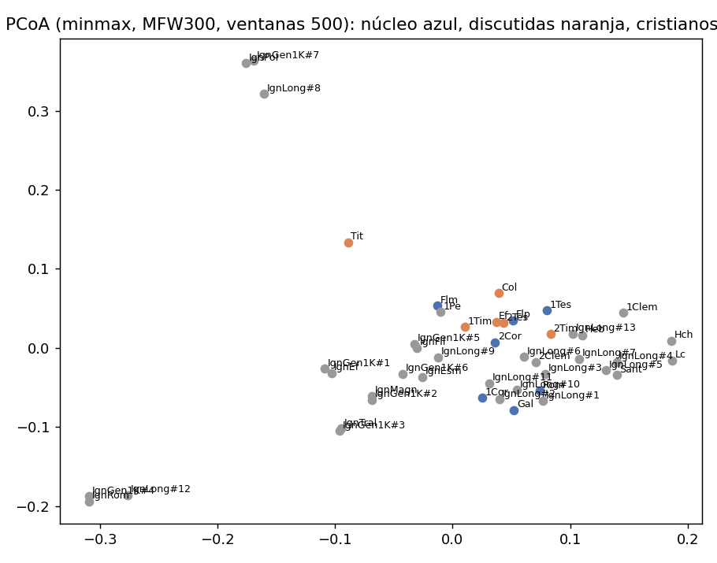

PCoA de los textos cristianos (fig_pcoa_christian.png)

La PCoA de los textos cristianos (fig_pcoa_christian.png) y las distancias por pares (pair_distances_minmax.csv) muestran lo que las cifras anteriores anticipan: un núcleo compacto (2 Cor, Gal, Rom, 1 Tes, Flm, Flp, en ese orden de proximidad al centroide), Ef y Col juntas y al borde del núcleo, 2 Tes pegada a 1 Tes, y las tres Pastorales juntas, más lejos, con Tito en el extremo. Es la misma estructura que Savoy 2019 (A-7) obtiene con otro texto (Bibelwissenschaft.de), otras distancias (Labbé, Delta) y otro método (agrupamiento jerárquico): {Rom, Gal, 1-2 Cor}, {Col, Ef}, {1-2 Tes}, {Tit, 1-2 Tim}, Filemón aparte y Filipenses inestable. La coincidencia es de **estructura**, no de veredicto: Savoy lee las agrupaciones como autores distintos («Col-Ef ... by the same author who seems not to be Paul»); esta campaña, tras calibrar con controles y aplicar el mismo rasero, lee las mismas agrupaciones como diferencias del orden de las que un autor seguro produce entre géneros y destinatarios. La discrepancia no está en los datos sino en el paso que Savoy no da: preguntar cuánto se alejan entre sí las obras de Josefo, Juliano o Isócrates.

Con la campaña previa del autor (V6): Tito «T3 plausible» encuentra aquí la carta más alejada del núcleo, pero dentro de la envolvente y con un veredicto no discriminante: el estilo no la contradice ni la apoya; es la carta en que la plausibilidad descansa más en el modo de producción. Colosenses «C2: producción amplia plausible, redacción personal especulativa» es compatible con lo observado (percentil 67, gemela de Ef, rasgos funcionales, tramo polémico bajo): el estilo favorece H2-H3 tanto como H1, no más. Efesios «E2: mediada especulativa» encaja con la misma lectura. 2 Tesalonicenses «S1: bien sustentada» es la que mejor sale de esta campaña entre las seis (distancia como 2 Cor, la más estable, la más alta en clase cerrada), con la reserva de sus 820 tokens. Ninguna de las cuatro decisiones de V6 es contradicha por los datos sellados; ninguna es tampoco demostrada por ellos.

Con Beijen y de Heide 2025 (A-10: Col y 2 Tes «paulinas», la mayoría de 1 Tim «no paulina», Tit/2 Tim/Ef variables) y con Pracht y McCauley 2025 (A-9: pocas diferencias significativas en los modos epistolares de las Pastorales): las tres campañas coinciden en que el resultado depende del tipo de rasgo, y ésta añade la razón: registro doctrinal compartido frente a morfología léxica propia.

*S.3 Lo que este estudio establece y lo que no*

Establece, bajo protocolo sellado y con error cuantificado: (1) que el método reconoce a Pablo frente a prosa no cristiana con AUC 0,88-0,98 y a cada carta del núcleo frente a las demás; (2) que ninguna de las seis cartas discutidas está a una distancia del núcleo inusual entre obras de un mismo autor de control; (3) que Ef, Col y 2 Tes están por debajo del núcleo y por encima de los negativos en todas las especificaciones, y que su separación es sintáctico-funcional; (4) que 1 Tim, 2 Tim y Tit comparten el vocabulario frecuente del núcleo y no su morfología léxica ni su gramática de la instrucción; (5) que las variables de situación explican dentro del corpus tanta variación como la identidad de carta; (6) que el método deja pasar como «misma mano» a tres de doce falsificaciones conocidas y a las siete interpolaciones de Ignacio.

No establece: quién escribió ninguna carta. La estilometría mide «misma mano que el núcleo» con un error conocido, y ese error incluye, en las dos direcciones, al secretario, al colaborador, al discípulo y al imitador competente. Para las seis cartas discutidas, la conclusión es la misma frase, y es la que el protocolo preregistró para este caso: no puede descartarse la autoría paulina por razones estilométricas; la decisión depende de las capas no estilométricas. El estilo solo desfavorece, en las seis, la pseudonimia ajena al círculo paulino (H5), porque las seis comparten el registro y el vocabulario del núcleo.

*S.4 Límites declarados*

Textos cortos (Flm, Tit, 2 Tes); secretario libre ≈ imitador; impostores mayoritariamente paganos y de otros siglos (la calibración secundaria lo corrige solo en parte); puntuación editorial excluida; etiquetado no uniforme (verificación solo con formas y caracteres); variables confundidas dentro del corpus; multiverso finito (48 + 33 especificaciones); dependencia Ef↔Col y 2 Tes→1 Tes tratada por exclusión, no por alineamiento; 3 Corintios con ortografía regularizada por Cowork; cinco fuentes de la tradición crítica sin cotejar (Tertuliano V, 21; Ef 1,1; Richards; Thackeray; Prior/Murphy-O'Connor/Johnson).

*S.5 Qué haría falta para decidir mejor*

Más impostores cristianos y judeo-helenísticos del s. I-II (TLG: Padres apologistas, Hermas por partes, Testamentos, Josefo ya está); cartas de mandato y de despedida de autores seguros como controles de género; lematización uniforme de todo el corpus (Diorisis o un único tagger) para separar morfología de léxico en las Pastorales; anotación manual de variables de situación en los controles para desconfundir; alineamiento de reutilización Ef↔Col y 2 Tes→1 Tes; 300-500 iteraciones para las cartas \< 1.000 tokens; un segundo modelo (SVM con validación cruzada por autor) como contraste; cotejo de las fuentes pendientes.

***Apéndices***

**A. Protocolo sellado.** results/PROTOCOLO_SELLADO_campana_01.json (íntegro; SHA-256 4eb0a436...6d08e2; archivos hasheados: config/default.yaml, los cuatro CSV de metadata/ y los quince módulos de paulinum/; reglas preregistradas: AUC mínima 0,80; banda de indecisión; veredicto por mediana de log10 LR; resultado adverso posible) y bloque preregistro: de config/default.yaml (rejilla, mismo rasero ≤ 90, carta por carta, calibración secundaria, reserva sobre 3 Cor, robustez en campaña aparte). Sellos de las cinco campañas de robustez en results/PROTOCOLO_SELLADO_campana_02\*.json.

**B. Inventario del corpus.** results/inventory.csv (217 documentos; id, autor, obra, género, estado, tier, grupo, tokens); procedencia y hashes en data/provenance.json; licencias en paulinum/sources.py; auditoría de estados en results/auditoria_sesion2.md.

**C. Calibración completa.** results/campana_01/calibration_by_spec.csv (48 filas: AUC, c@1, banda, FPR, FNR, indecisos) y calibracion_secundaria_cristiana.csv; resultados por problema en gi_results_all_specs.csv (20.160 filas) y specs/000-047.json.

**D. Bibliografía.** docs/bibliografia_verificada.md: A-1...A-13 (método y estado de la cuestión), B-1...B-11 (estados de los controles), E-1...E-7 (capas no estilométricas), y sección D («por verificar»: Richards 2004, Thackeray 1929, Prior 1989, Murphy-O'Connor 1995, Johnson 2001, Moule 1965, Wilson 1979, Metzger 1958, Kenny 1986, Neumann 1990, Mealand 1995, Ledger 1995, Barr 2004, Libby 2016, Tuccinardi 2017, van Nes 2018, White 2025, Livesey 2024/2026, Anazawa 2026, Luce & Robertson 2025, Rich 2025; más E-5, Tertuliano V, 21). Ninguna obra de la sección D se cita en el cuerpo de este informe como fuente de una afirmación.

**E. Bitácora.** results/campana_01/bitacora.md (sesiones 0-7: comandos, resultados, tiempos, incidencias) y results/bitacora_preparacion.md.

**F. Glosario.** *GI*: puntuación de los impostores generales, fracción de iteraciones en que el candidato más cercano supera al impostor más cercano. *AUC*: área bajo la curva ROC, probabilidad de que un positivo puntúe más que un negativo. *c@1*: exactitud que recompensa la abstención (Peñas y Rodrigo 2011). *LR*: razón de verosimilitud f(GI \| misma mano) / f(GI \| otra mano) estimada por densidades de los controles. *Delta*: distancia de Burrows sobre frecuencias estandarizadas. *Min-max* (Ruzicka): 1 − Σmin/Σmax sobre frecuencias relativas. *PERMANOVA*: análisis de varianza por permutación sobre una matriz de distancias. *dbRDA*: regresión sobre coordenadas principales; R² único = lo que pierde el modelo al quitar la variable. *Percentil intra-autor*: posición de la distancia de una carta al núcleo entre las distancias de obras distintas de un mismo autor de control. *H1-H5*: redacción personal; secretario limitado; composición delegada en vida; escuela posterior; pseudonimia ajena.

***Apéndice G · Revisión adversaria (sesión 8)***

Método: para cada conclusión del informe, buscar en el propio material sellado la especificación que la contradice y el control que la relativiza; comprobar las frases; enumerar y priorizar los derrotadores. Archivos: gi_results_all_specs.csv, lr_secundaria_por_spec.csv, pair_distances_minmax.csv, double_standard_ledger_minmax.csv.

*G.1 ¿Qué especificaciones contradicen el veredicto «no discriminante»?*

Fracción de las 48 especificaciones cuyo log10 LR apoya a «otra mano» (\< −0,3), es neutro (\|·\| ≤ 0,3) o apoya a «misma mano» (\> 0,3), calibración principal / cristiana, y extremos:

  -------------------------------------------------------------------------------------------------------------------------------------------------------------------------------------
  carta     otra mano     neutro        misma mano    mínimo (especificación)                             máximo (especificación)                        specs con LR cristiana \< −1
  --------- ------------- ------------- ------------- --------------------------------------------------- ---------------------------------------------- ------------------------------
  Ef        0 % / 8 %     42 % / 75 %   58 % / 17 %   −0,26 (closed·minmax·entero·nodia) / −0,56          +0,81 (mfw·delta·w500·máscara·nodia) / +0,53   0

  Col       4 % / 21 %    35 % / 62 %   60 % / 17 %   −0,35 (closed·minmax·entero·máscara) / −0,62        +1,00 (char3·minmax·w500·máscara) / +1,03      0

  2 Tes     0 % / 0 %     29 % / 73 %   71 % / 27 %   +0,02 (mfw·delta·entero·nodia) / −0,22              +1,73 (char3·minmax·entero·máscara) / +2,36    0

  1 Tim     21 % / 35 %   46 % / 50 %   33 % / 15 %   −1,46 (char3·delta·entero·máscara·nodia) / −1,23    +0,87 (mfw·minmax·w500) / +0,57                2

  2 Tim     8 % / 46 %    62 % / 46 %   29 % / 8 %    −0,90 (char3·minmax·entero·máscara·nodia) / −1,08   +1,51 (mfw·delta·entero·nodia) / +1,16         1

  Tit       33 % / 44 %   44 % / 44 %   23 % / 12 %   −1,62 (char3·minmax·entero·máscara·nodia) / −1,38   +1,30 (mfw·delta·w500·máscara·nodia) / +1,07   6
  -------------------------------------------------------------------------------------------------------------------------------------------------------------------------------------

Lectura adversaria. (a) Para Ef, Col y 2 Tes ninguna especificación de la campaña principal apoya «otra mano» más que débilmente (mínimos −0,26 / −0,35 / +0,02), y con negativos cristianos ninguna baja de −0,62: el veredicto «no discriminante» es, si acaso, conservador hacia abajo; la mayoría de las especificaciones (58-71 %) dan apoyo débil a «misma mano» con la calibración principal. (b) Para las Pastorales la mediana esconde una distribución **bimodal**: en Tito, un tercio de las especificaciones (las de caracteres, sobre todo con documento entero y máscara) apoya «otra mano» hasta −1,62 (moderado), y casi un cuarto (las de palabras frecuentes con Delta) apoya «misma mano» hasta +1,30. Con negativos cristianos, seis especificaciones dan a Tito apoyo moderado a «otra mano» (\< −1). **Un lector que solo mirase las especificaciones de caracteres concluiría «apoyo moderado a otra mano» para Tito y 1 Tim; uno que solo mirase las de palabras frecuentes concluiría «apoyo débil-moderado a la misma mano».** El informe no elige entre ellas: informa el gradiente y su explicación (registro compartido frente a morfología propia), que es lo que el protocolo sellado permite.

*G.2 ¿Depende el «mismo rasero» de cómo se construye la envolvente?*

Percentil de la distancia al núcleo (min-max) según la envolvente intra-autor usada:

  ---------------------------------------------------------------------------------------------------------------------------
  envolvente                                        pares   Ef      Col     2 Tes   1 Tim   2 Tim   Tit       Rom     1 Cor
  ------------------------------------------------- ------- ------- ------- ------- ------- ------- --------- ------- -------
  sellada (genuine, tope 120/autor)                 385     54      67      22      56      33      78        59      66

  sin tope                                          1034    35      45      13      36      21      59        39      45

  **sin las cartas de Juliano**                     368     70      85      21      71      38      **92**    77      85

  solo pares con cambio de género                   157     57      71      18      57      31      82        62      71

  solo pares del mismo género                       877     31      41      12      32      19      55        35      40

  solo autores cristianos (Ignacio, Lucas-Hechos)   22      45      68      32      50      36      **100**   59      68

  solo Josefo                                       223     67      86      7       70      26      87        77      86
  ---------------------------------------------------------------------------------------------------------------------------

Lectura adversaria. **La conclusión «Tito no es anómala» depende de la envolvente.** Sin las 66 cartas de Juliano (que aportan las distancias intra-autor más altas del corpus, hasta 0,81), Tito sube al percentil 92 y cruza la regla; con solo los dos autores cristianos de control (22 pares: pocos y no representativos), al 100. Dos observaciones limitan el alcance de esta objeción: (1) en las mismas envolventes, 1 Corintios y Colosenses suben a 85-86 y Romanos a 77: una envolvente que hace anómala a Tito deja a 1 Corintios a cinco puntos de serlo, lo que es la definición del doble rasero que el protocolo quiere evitar; (2) la envolvente sellada se preregistró (genuine, tope 120 por autor) precisamente para que ningún autor la dominase ni se eligiera a posteriori. La conclusión se mantiene, reformulada con mayor precisión: **Tito está en el borde de la envolvente intra-autor de los controles, y el lado del borde en que cae depende de si se admiten como control las cartas breves de un mismo autor (Juliano) o solo sus obras largas (Josefo)**. Para las otras cinco cartas ninguna envolvente supera 86 (Col sin Juliano), y ninguna las separa de Romanos y 1 Corintios.

*G.3 ¿Es la calibración demasiado fácil?*

Objeción: los positivos incluyen pares fáciles (Isócrates 0,96, Josefo 0,80) y los negativos son mayoritariamente paganos. Respuesta con el propio material: (a) la AUC calculada solo con positivos y negativos cristianos (Ignacio, Lucas-Hechos, núcleo en leave-one-out frente a negativos cristianos) es 0,862-0,989 según la especificación (calibracion_secundaria_cristiana.csv, columna auc_pos_y_neg_cristianos): más baja, pero por encima del umbral en todas; (b) la LR cristiana ya se informa en todos los capítulos; (c) queda en pie que el conjunto de problemas negativos cristianos es pequeño (97 de 326, con solo 16 positivos cristianos) y heterogéneo (evangelios, apocalipsis, homilías), de modo que la calibración secundaria es una cota, no un sustituto. Esta es la limitación más seria del estudio y encabeza la agenda (G.5).

*G.4 Frases y formulaciones*

Búsqueda en el informe de «demuestra», «prueba que», «descarta», «establece que» aplicados a una carta: no aparecen; «descartarse» aparece solo en la fórmula preregistrada «no puede descartarse la autoría paulina por razones estilométricas». Las afirmaciones cuantitativas llevan archivo y sello; las bibliográficas, clave de docs/bibliografia_verificada.md; las no verificadas se declaran pendientes (E-5, Ef 1,1, sección D). Se ha comprobado que ningún capítulo atribuye a una carta discutida un apoyo superior al de la carta del núcleo peor reconocida (Flp, GI 0,76, LR 0,65): ninguna de las seis lo supera en ninguna mediana.

*G.5 Derrotadores priorizados por carta (automáticos + del analista, de mayor a menor peso)*

-   **Ef**: 1) calibración secundaria (zona de 1 Pe, Ignacio, 2-3 Jn); 2) registro litúrgico y 35 % de material formular; 3) dependencia de Col; 4) circular sin situación concreta; 5) límite frente al imitador competente (3 Cor 0,58); 6) confusión de variables; 7) Ef 1,1 sin cotejar.

-   **Col**: 1) calibración secundaria; 2) 42 % de material preformado; 3) dependencia de Ef; 4) tramo polémico 2,8-3,17 bajo en mfw; 5) 1.580 tokens; 6) imitador competente; 7) percentil 85-86 en envolventes sin Juliano (como 1 Cor).

-   **2 Tes**: 1) 820 tokens (intervalo 0,42-1,00); 2) dependencia de 1 Tes (0,91 frente a 0,67); 3) calibración secundaria; 4) tema escatológico concentrado; 5) el argumento interno de 3,17/2,2 es de doble filo y el estilo no lo valora.

-   **1 Tim**: 1) gradiente de familias (LR de −1,46 a +0,87); 2) género de mandato sin paralelo en el núcleo salvo Flm; 3) calibración secundaria (35 % de especificaciones apoyan «otra mano»); 4) confusión total de variables de situación; 5) registro doctrinal compartido que infla mfw; 6) 1.591 tokens.

-   **2 Tim**: 1) gradiente y máscara (0,56 → 0,44); 2) 46 % de especificaciones cristianas apoyan «otra mano»; 3) registro personal-testamentario sin paralelo; 4) 1.235 tokens; 5) la aparente contradicción distancia (percentil 33) / GI (0,48) exige explicación por el impostor más cercano.

-   **Tit**: 1) 659 tokens (LR de −1,62 a +1,30; seis especificaciones cristianas \< −1); 2) envolvente: percentil 78 sellado, 92 sin Juliano, 100 solo cristianos; 3) gradiente extremo (char3 0,07 / mfw 0,76);

    4.  género de mandato en su forma más concentrada; 5) prescripto de 65 palabras; 6) confusión de variables.

*G.6 Qué haría falta para decidir mejor (agenda priorizada)*

1.  **Negativos cristianos y judeo-helenísticos del s. I-II** (TLG: Justino, Taciano, Atenágoras, Teófilo, Melitón, *Testamentos de los Doce Patriarcas*, *Oráculos sibilinos* en prosa, Filón completo, Josefo ya está): es la única manera de que la calibración secundaria deje de ser una cota.

2.  **Controles de género** con autoría segura: cartas de mandato a colaboradores (Juliano a Ecdicio ya está; Libanio, tier 3), cartas de despedida, cartas circulares, cartas con himnos incrustados (Ignacio Ef 19).

3.  **Lematización uniforme** (Diorisis o un único tagger aplicado a todo el corpus) para separar en las Pastorales lo que es morfología (n-gramas) de lo que es léxico (lemas).

4.  **Anotación de variables de situación en los controles** para desconfundir polémica, co-remitentes y registro de la autoría.

5.  **Alineamiento explícito de reutilización** Ef↔Col y 2 Tes→1 Tes, con exclusión de los pasajes paralelos antes de medir.

6.  **300-500 iteraciones** y remuestreo de la envolvente para las cartas \< 1.000 tokens (Tit, 2 Tes, Flm), con intervalos de confianza por bootstrap del percentil.

7.  **Segundo modelo** (SVM o regresión logística con validación cruzada por autor) como contraste del GI.

8.  **Cotejo de las fuentes pendientes**: Tertuliano *Adv. Marc.* V, 21; Ef 1,1 en NA28; Richards 2004; Prior 1989; Murphy-O'Connor 1995; Johnson 2001.
