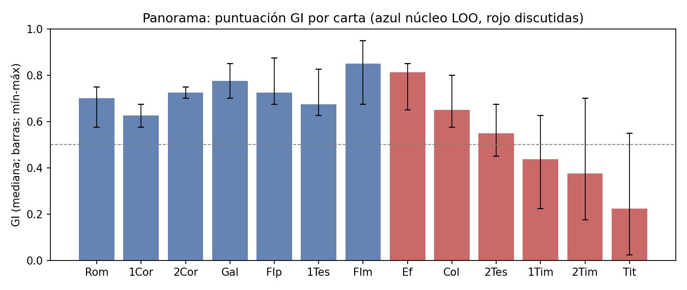
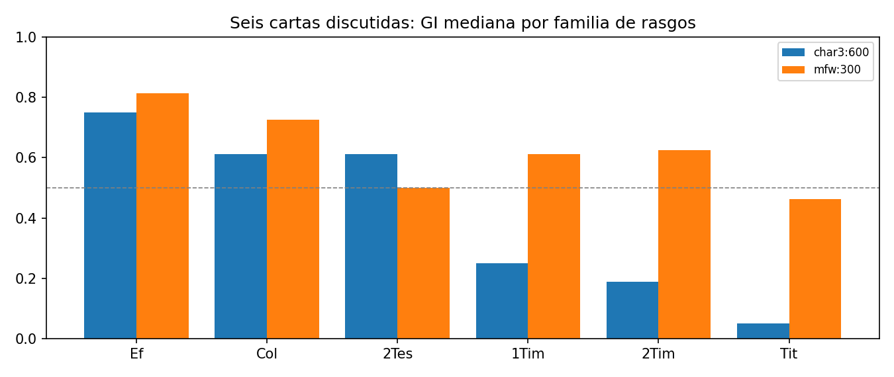
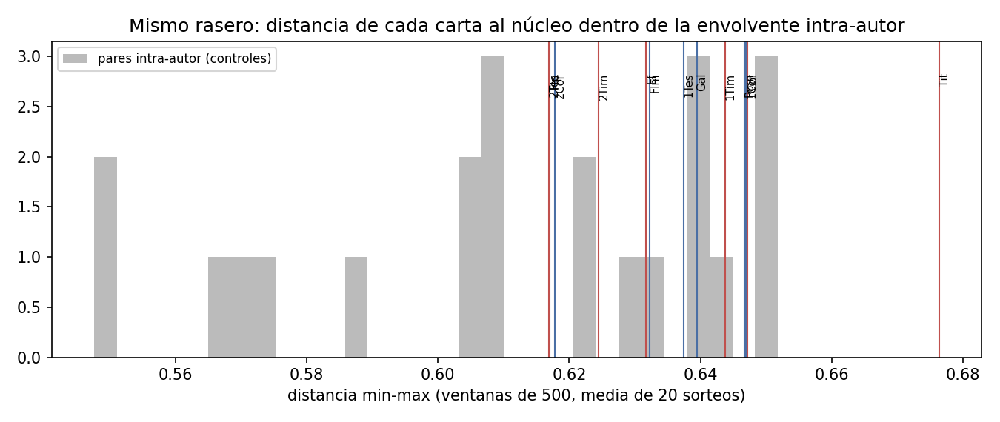
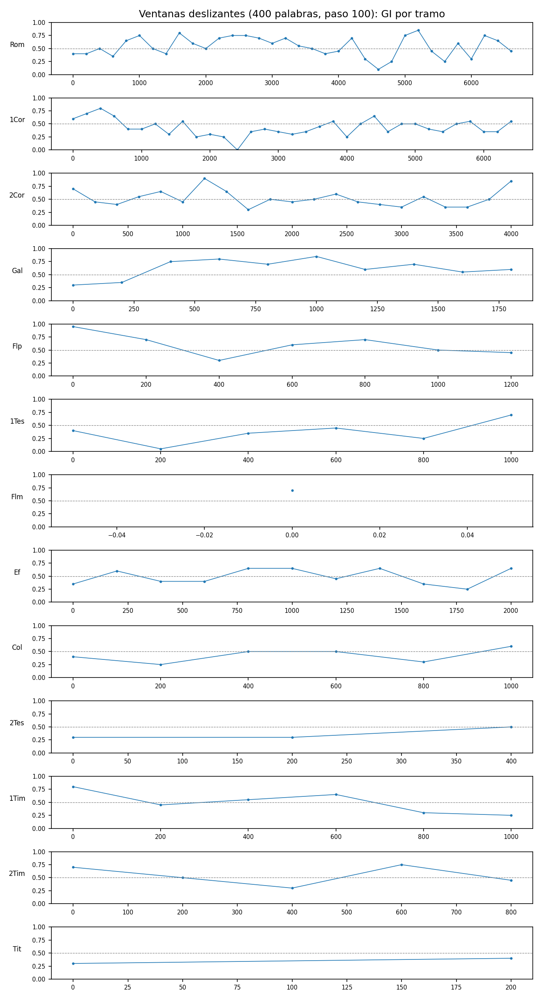

# Informe automático · prueba_reducida

Generado por paulinum 0.2.0-r (reconstrucción). Configuración: `prueba_reducida` — prueba de extremo a extremo con NT + Padres Apostólicos; 4 especificaciones, 40 iteraciones

Este informe es una lectura mecánica de las tablas de results/. La interpretación corresponde al informe final.

## 1. Calibración por especificación

4 especificaciones; AUC 0.838–0.936 (mediana 0.899); válidas (AUC ≥ 0.8): 4.

| spec_index | dia | features | metric | window | mask | n_pos | n_neg | auc | c_at_1 | thr_low | thr_high | fpr_at_0.5 | fnr_at_0.5 |
|---|---|---|---|---|---|---|---|---|---|---|---|---|---|
| 0 | dia | mfw:300 | minmax | 500 | none | 15 | 39 | 0.908 | 0.816 | 0.350 | 0.650 | 0.308 | 0.133 |
| 1 | dia | mfw:300 | delta | 500 | none | 15 | 39 | 0.838 | 0.782 | 0.450 | 0.550 | 0.282 | 0.133 |
| 2 | dia | char3:600 | minmax | 500 | none | 15 | 39 | 0.936 | 0.890 | 0.400 | 0.600 | 0.154 | 0.133 |
| 3 | dia | char3:600 | delta | 500 | none | 15 | 39 | 0.890 | 0.835 | 0.450 | 0.550 | 0.256 | 0.133 |

Calibración secundaria (negativos cristianos):

| spec_index | features | metric | mask | n_neg_cristianos | auc_cristiana | auc_cristiana_pos_cristianos | fpr_cristiana_0.5 |
|---|---|---|---|---|---|---|---|
| 0 | mfw:300 | minmax | none | 39 | 0.908 | 0.908 | 0.308 |
| 1 | mfw:300 | delta | none | 39 | 0.838 | 0.838 | 0.282 |
| 2 | char3:600 | minmax | none | 39 | 0.936 | 0.936 | 0.154 |
| 3 | char3:600 | delta | none | 39 | 0.890 | 0.890 | 0.256 |

## 2. Resumen por carta (especificaciones válidas)

| id | kind | n_specs | score_median | score_q1 | score_q3 | score_min | score_max | frac_specs_ge_0_5 | log10lr_median | log10lr_q1 | log10lr_q3 |
|---|---|---|---|---|---|---|---|---|---|---|---|
| Rom | core_loo | 4 | 0.700 | 0.669 | 0.712 | 0.575 | 0.750 | 1.000 | 0.235 | 0.153 | 0.310 |
| 1Cor | core_loo | 4 | 0.625 | 0.613 | 0.637 | 0.575 | 0.675 | 1.000 | 0.149 | 0.144 | 0.157 |
| 2Cor | core_loo | 4 | 0.725 | 0.719 | 0.731 | 0.700 | 0.750 | 1.000 | 0.269 | 0.255 | 0.299 |
| Gal | core_loo | 4 | 0.775 | 0.738 | 0.812 | 0.700 | 0.850 | 1.000 | 0.361 | 0.315 | 0.379 |
| Flp | core_loo | 4 | 0.725 | 0.675 | 0.800 | 0.675 | 0.875 | 1.000 | 0.326 | 0.197 | 0.442 |
| 1Tes | core_loo | 4 | 0.675 | 0.644 | 0.731 | 0.625 | 0.825 | 1.000 | 0.225 | 0.161 | 0.327 |
| Flm | core_loo | 4 | 0.850 | 0.769 | 0.912 | 0.675 | 0.950 | 1.000 | 0.410 | 0.296 | 0.501 |
| Ef | target | 4 | 0.812 | 0.744 | 0.850 | 0.650 | 0.850 | 1.000 | 0.317 | 0.300 | 0.348 |
| Col | target | 4 | 0.650 | 0.631 | 0.688 | 0.575 | 0.800 | 1.000 | 0.172 | 0.136 | 0.238 |
| 2Tes | target | 4 | 0.550 | 0.525 | 0.581 | 0.450 | 0.675 | 0.750 | 0.079 | 0.021 | 0.134 |
| 1Tim | target | 4 | 0.438 | 0.263 | 0.606 | 0.225 | 0.625 | 0.500 | -0.122 | -0.333 | 0.086 |
| 2Tim | target | 4 | 0.375 | 0.194 | 0.588 | 0.175 | 0.700 | 0.500 | -0.189 | -0.408 | 0.070 |
| Tit | target | 4 | 0.225 | 0.062 | 0.419 | 0.025 | 0.550 | 0.250 | -0.330 | -0.505 | -0.129 |

## 3. Razones de verosimilitud (log10) con todos los negativos y con negativos cristianos

| target | log10lr_principal_mediana | log10lr_cristiana_mediana | log10lr_cristiana_q1 | log10lr_cristiana_q3 | log10lr_cristiana_min | log10lr_cristiana_max | verbal_cristiana_mediana | log10lr_cj_mediana |
|---|---|---|---|---|---|---|---|---|
| Rom | 0.235 | 0.235 | 0.153 | 0.310 | 0.099 | 0.345 | no discriminante | 0.235 |
| 1Cor | 0.149 | 0.149 | 0.144 | 0.157 | 0.143 | 0.168 | no discriminante | 0.149 |
| 2Cor | 0.269 | 0.269 | 0.255 | 0.299 | 0.223 | 0.383 | no discriminante | 0.269 |
| Gal | 0.361 | 0.361 | 0.315 | 0.379 | 0.223 | 0.388 | apoyo débil a H_mismo-autor | 0.361 |
| Flp | 0.326 | 0.326 | 0.197 | 0.442 | 0.145 | 0.452 | apoyo débil a H_mismo-autor | 0.326 |
| 1Tes | 0.225 | 0.225 | 0.161 | 0.327 | 0.091 | 0.513 | no discriminante | 0.225 |
| Flm | 0.410 | 0.410 | 0.296 | 0.501 | 0.145 | 0.581 | apoyo débil a H_mismo-autor | 0.410 |
| Ef | 0.317 | 0.317 | 0.300 | 0.348 | 0.267 | 0.420 | apoyo débil a H_mismo-autor | 0.317 |
| Col | 0.172 | 0.172 | 0.136 | 0.238 | 0.118 | 0.347 | no discriminante | 0.172 |
| 2Tes | 0.079 | 0.079 | 0.021 | 0.134 | -0.088 | 0.234 | no discriminante | 0.079 |
| 1Tim | -0.122 | -0.122 | -0.333 | 0.086 | -0.407 | 0.153 | no discriminante | -0.122 |
| 2Tim | -0.189 | -0.189 | -0.408 | 0.070 | -0.464 | 0.244 | no discriminante | -0.189 |
| Tit | -0.330 | -0.330 | -0.505 | -0.129 | -0.566 | 0.012 | apoyo débil a H_otro-autor | -0.330 |

## 4. Seis cartas discutidas por familia de rasgos, distancia y máscara

| features | metric | mask | window | dia | Ef | Col | 2Tes | 1Tim | 2Tim | Tit |
|---|---|---|---|---|---|---|---|---|---|---|
| char3:600 | delta | none | 500 | dia | 0.850 | 0.650 | 0.675 | 0.275 | 0.200 | 0.075 |
| char3:600 | minmax | none | 500 | dia | 0.650 | 0.575 | 0.550 | 0.225 | 0.175 | 0.025 |
| mfw:300 | delta | none | 500 | dia | 0.850 | 0.650 | 0.450 | 0.600 | 0.550 | 0.550 |
| mfw:300 | minmax | none | 500 | dia | 0.775 | 0.800 | 0.550 | 0.625 | 0.700 | 0.375 |

## 5. Mismo rasero

Envolvente intra-autor (min-max): 22 pares; mín 0.548, Q1 0.592, mediana 0.616, Q3 0.640, máx 0.652.

| carta | tipo | d media min-max | d mín | d máx | percentil min-max | percentil Delta |
|---|---|---|---|---|---|---|
| Rom | core | 0.647 | 0.624 | 0.680 | 0.864 | 0.955 |
| 1Cor | core | 0.647 | 0.618 | 0.675 | 0.864 | 0.955 |
| 2Cor | core | 0.618 | 0.601 | 0.642 | 0.500 | 0.682 |
| Gal | core | 0.639 | 0.624 | 0.652 | 0.727 | 0.955 |
| Flp | core | 0.617 | 0.573 | 0.656 | 0.500 | 0.727 |
| 1Tes | core | 0.637 | 0.597 | 0.676 | 0.682 | 0.727 |
| Flm | core | 0.632 | 0.566 | 0.688 | 0.682 | 0.591 |
| Ef | target | 0.632 | 0.598 | 0.683 | 0.636 | 0.773 |
| Col | target | 0.647 | 0.592 | 0.676 | 0.864 | 0.636 |
| 2Tes | target | 0.617 | 0.575 | 0.647 | 0.500 | 0.591 |
| 1Tim | target | 0.644 | 0.616 | 0.677 | 0.818 | 0.955 |
| 2Tim | target | 0.624 | 0.588 | 0.676 | 0.591 | 0.909 |
| Tit | target | 0.676 | 0.634 | 0.704 | 1.000 | 0.955 |

Regla preregistrada: ninguna carta se declara anómala si su percentil intra-autor es ≤ 0,90.

## 6. Variables de situación dentro del corpus paulino (PERMANOVA, ventanas de 400)

| variable | n | k | R2 | pseudo_F | p |
|---|---|---|---|---|---|
| addressee_type | 76 | 2 | 0.029 | 2.217 | 0.005 |
| captivity | 76 | 2 | 0.039 | 2.970 | 0.005 |
| polemic_level | 76 | 4 | 0.077 | 1.999 | 0.005 |
| n_cosenders | 76 | 3 | 0.048 | 1.838 | 0.005 |
| liturgical_register | 76 | 4 | 0.073 | 1.896 | 0.005 |
| church_order | 76 | 2 | 0.040 | 3.111 | 0.005 |
| letter | 76 | 13 | 0.236 | 1.622 | 0.005 |
| group | 76 | 3 | 0.065 | 2.552 | 0.005 |

## 8. Rasgos que separan (z frente a la dispersión interna del núcleo, mfw:300, ‰)

**Rom**: λαόν (1.16 ‰ vs 0.17 ‰, z=2.27); κύριε (0.46 ‰ vs 0.07 ‰, z=2.27); ἔλεγεν (0.23 ‰ vs 0.03 ‰, z=2.27); ἐκεῖ (0.46 ‰ vs 0.07 ‰, z=2.27); γῆν (0.23 ‰ vs 0.03 ‰, z=2.27); τέ (3.93 ‰ vs 0.93 ‰, z=2.15); πατέρα (1.16 ‰ vs 0.22 ‰, z=2.14); ἁμαρτίασ (3.7 ‰ vs 0.84 ‰, z=2.13); οὖν (10.87 ‰ vs 5.38 ‰, z=2.06); λέγει (4.63 ‰ vs 1.26 ‰, z=2.05)

**1Cor**: εἶτα (0.76 ‰ vs 0.11 ‰, z=2.27); ὧδε (0.25 ‰ vs 0.04 ‰, z=2.27); δώδεκα (0.25 ‰ vs 0.04 ‰, z=2.27); λέγουσιν (0.25 ‰ vs 0.04 ‰, z=2.27); γυνή (4.06 ‰ vs 0.61 ‰, z=2.26); ἀνήρ (3.8 ‰ vs 0.64 ‰, z=2.23); δύναται (1.27 ‰ vs 0.21 ‰, z=2.23); σῶμα (6.08 ‰ vs 1.32 ‰, z=2.2); ἔχει (3.04 ‰ vs 0.62 ‰, z=2.16); πάντεσ (7.1 ‰ vs 2.24 ‰, z=2.14)

**2Cor**: ἧσ (0.79 ‰ vs 0.11 ‰, z=2.27); ἐκεῖνοσ (0.39 ‰ vs 0.06 ‰, z=2.27); ἐποίησεν (0.39 ‰ vs 0.06 ‰, z=2.27); πόλιν (0.39 ‰ vs 0.06 ‰, z=2.27); ἑαυτούσ (6.7 ‰ vs 1.16 ‰, z=2.24); ταύτην (1.58 ‰ vs 0.29 ‰, z=2.22); ἔδωκεν (1.18 ‰ vs 0.24 ‰, z=2.19); ἀληθείασ (1.58 ‰ vs 0.33 ‰, z=2.16); ἰδού (2.36 ‰ vs 0.51 ‰, z=2.15); ἀλλά (26.79 ‰ vs 17.32 ‰, z=2.03)

**Gal**: πέτροσ (0.75 ‰ vs 0.11 ‰, z=2.27); ἦλθεν (1.51 ‰ vs 0.22 ‰, z=2.27); ἦσαν (1.51 ‰ vs 0.25 ‰, z=2.24); υἱόσ (2.26 ‰ vs 0.45 ‰, z=2.23); πρό (2.26 ‰ vs 0.48 ‰, z=2.19); ἀβραάμ (6.78 ‰ vs 1.32 ‰, z=2.16); ὅτε (4.52 ‰ vs 1.21 ‰, z=2.15); ἔργων (4.52 ‰ vs 0.91 ‰, z=2.08); ἁμαρτιῶν (0.75 ‰ vs 0.18 ‰, z=2.07); ὅσοι (3.01 ‰ vs 0.71 ‰, z=2.06)

**Flp**: ἰδών (1.05 ‰ vs 0.15 ‰, z=2.27); ὅσα (6.32 ‰ vs 1.01 ‰, z=2.26); ζωῆσ (3.16 ‰ vs 0.66 ‰, z=2.16); ἤδη (3.16 ‰ vs 0.66 ‰, z=2.14); τοῦ (18.97 ‰ vs 30.53 ‰, z=-2.11); θανάτου (4.21 ‰ vs 1.03 ‰, z=2.07); καρπόν (2.11 ‰ vs 0.47 ‰, z=2.05); ὄνομα (2.11 ‰ vs 0.51 ‰, z=2.04); ὀνόματι (1.05 ‰ vs 0.26 ‰, z=1.99); πάσησ (1.05 ‰ vs 0.27 ‰, z=1.95)

**1Tes**: ἔρχεται (1.18 ‰ vs 0.17 ‰, z=2.27); ὁδόν (1.18 ‰ vs 0.24 ‰, z=2.19); αὐτοί (7.11 ‰ vs 1.7 ‰, z=2.13); καθώσ (15.4 ‰ vs 5.0 ‰, z=2.12); ἀλλήλουσ (5.92 ‰ vs 1.71 ‰, z=2.1); εἰ (1.18 ‰ vs 11.75 ‰, z=-2.08); τούτων (1.18 ‰ vs 0.27 ‰, z=2.05); τούσ (11.85 ‰ vs 6.93 ‰, z=2.04); ἰουδαίων (1.18 ‰ vs 0.29 ‰, z=2.02); ἡμέρασ (4.74 ‰ vs 1.32 ‰, z=2.02)

**Flm**: οἶκον (5.85 ‰ vs 0.94 ‰, z=2.26); ὅν (17.54 ‰ vs 3.42 ‰, z=2.26); παῦλοσ (17.54 ‰ vs 3.5 ‰, z=2.25); χάρισ (11.7 ‰ vs 3.46 ‰, z=2.24); ὅπωσ (5.85 ‰ vs 1.19 ‰, z=2.24); παντόσ (5.85 ‰ vs 1.13 ‰, z=2.23); γένηται (5.85 ‰ vs 1.53 ‰, z=2.22); χωρίσ (5.85 ‰ vs 1.41 ‰, z=2.19); ἥν (5.85 ‰ vs 1.43 ‰, z=2.18); ἰησοῦν (5.85 ‰ vs 2.12 ‰, z=2.13)

**Ef**: ἄνδρεσ (1.34 ‰ vs 0.0 ‰, z=1344086021.51); ἀκούσαντεσ (0.67 ‰ vs 0.0 ‰, z=672043010.75); γῆσ (2.69 ‰ vs 0.11 ‰, z=13.12); πάσησ (3.36 ‰ vs 0.27 ‰, z=7.73); ἧσ (2.02 ‰ vs 0.11 ‰, z=6.39); τοῖσ (19.49 ‰ vs 7.78 ‰, z=5.74); πατέρα (2.69 ‰ vs 0.22 ‰, z=5.64); ᾧ (6.72 ‰ vs 1.28 ‰, z=5.26); αὐτοῦ (22.18 ‰ vs 5.51 ‰, z=5.18); πᾶσα (2.69 ‰ vs 0.5 ‰, z=4.58)

**Col**: ἄνδρεσ (1.06 ‰ vs 0.0 ‰, z=1059322033.9); ἀκούσαντεσ (1.06 ‰ vs 0.0 ‰, z=1059322033.9); γῆσ (4.24 ‰ vs 0.11 ‰, z=20.98); ὧδε (1.06 ‰ vs 0.04 ‰, z=10.68); ἧσ (3.18 ‰ vs 0.11 ‰, z=10.29); αὐτῷ (12.71 ‰ vs 2.39 ‰, z=9.15); ὅπου (1.06 ‰ vs 0.07 ‰, z=8.36); ἄνθρωπον (4.24 ‰ vs 0.7 ‰, z=6.31); πᾶν (5.3 ‰ vs 0.73 ‰, z=5.44); πάσησ (2.12 ‰ vs 0.27 ‰, z=4.62)

**2Tes**: ἀληθείασ (3.99 ‰ vs 0.33 ‰, z=6.33); ἧσ (2.0 ‰ vs 0.11 ‰, z=6.32); κύριοσ (11.98 ‰ vs 2.23 ‰, z=5.76); μηδέ (3.99 ‰ vs 0.56 ‰, z=5.59); αὐτούσ (5.99 ‰ vs 0.86 ‰, z=5.5); πάντων (7.98 ‰ vs 2.07 ‰, z=5.33); τοῖσ (17.96 ‰ vs 7.78 ‰, z=5.0); ὀνόματι (2.0 ‰ vs 0.26 ‰, z=4.35); καρδίασ (3.99 ‰ vs 0.85 ‰, z=3.97); παρά (5.99 ‰ vs 1.85 ‰, z=3.97)

**1Tim**: ἄνδρεσ (1.25 ‰ vs 0.0 ‰, z=1254705144.29); χεῖρασ (2.51 ‰ vs 0.09 ‰, z=15.16); λέγουσιν (1.25 ‰ vs 0.04 ‰, z=12.72); ἐνώπιον (7.53 ‰ vs 0.47 ‰, z=12.04); πάσησ (5.02 ‰ vs 0.27 ‰, z=11.88); κόσμον (2.51 ‰ vs 0.19 ‰, z=9.44); πίστει (7.53 ‰ vs 0.81 ‰, z=8.46); καλόν (6.27 ‰ vs 0.76 ‰, z=8.36); εἶτα (2.51 ‰ vs 0.11 ‰, z=8.35); ἀνθρώπων (7.53 ‰ vs 1.22 ‰, z=8.02)

**2Tim**: λέγοντεσ (1.54 ‰ vs 0.0 ‰, z=1540832049.31); ἀληθείασ (6.16 ‰ vs 0.33 ‰, z=10.08); ἐκεῖνοσ (1.54 ‰ vs 0.06 ‰, z=9.97); ἔργα (3.08 ‰ vs 0.23 ‰, z=9.28); κύριοσ (15.41 ‰ vs 2.23 ‰, z=7.78); ἔσται (4.62 ‰ vs 0.49 ‰, z=7.63); λόγοσ (4.62 ‰ vs 0.57 ‰, z=6.53); ἐγένετο (3.08 ‰ vs 0.33 ‰, z=6.48); τούτων (3.08 ‰ vs 0.27 ‰, z=6.31); παρά (7.7 ‰ vs 1.85 ‰, z=5.61)

**Tit**: πόλιν (3.12 ‰ vs 0.06 ‰, z=20.61); εἶπεν (3.12 ‰ vs 0.09 ‰, z=18.59); ἐκεῖ (3.12 ‰ vs 0.07 ‰, z=17.5); δεῖ (9.38 ‰ vs 0.55 ‰, z=15.55); πάσησ (6.25 ‰ vs 0.27 ‰, z=14.96); εἶναι (18.75 ‰ vs 2.34 ‰, z=11.49); πίστει (9.38 ‰ vs 0.81 ‰, z=10.79); λόγοσ (6.25 ‰ vs 0.57 ‰, z=9.15); ἔργων (15.62 ‰ vs 0.91 ‰, z=8.48); μηδέν (6.25 ‰ vs 0.68 ‰, z=7.34)

## 9. Ventanas deslizantes

- Rom: 34 ventanas, mediana 0.53, mín 0.10 (13 por debajo de 0,5: 1:1–1:25; 1:13–2:3; 2:3–3:1; 3:30–4:24; 9:4–9:29)
- 1Cor: 33 ventanas, mediana 0.40, mín 0.00 (19 por debajo de 0,5: 3:2–4:5; 3:15–4:17; 4:17–6:8; 6:8–7:12; 6:19–7:24)
- 2Cor: 21 ventanas, mediana 0.50, mín 0.30 (10 por debajo de 0,5: 1:10–2:7; 1:19–3:2; 3:14–5:1; 5:14–7:1; 7:1–8:6)
- Gal: 10 ventanas, mediana 0.65, mín 0.30 (2 por debajo de 0,5: 1:1–2:2; 1:13–2:14)
- Flp: 7 ventanas, mediana 0.60, mín 0.30 (2 por debajo de 0,5: 1:25–2:22; 3:18–4:21)
- 1Tes: 6 ventanas, mediana 0.38, mín 0.05 (5 por debajo de 0,5: 1:1–2:11; 1:10–2:20; 2:12–3:11; 3:1–4:10; 3:11–5:3)
- Flm: 1 ventanas, mediana 0.70, mín 0.70 (0 por debajo de 0,5)
- Ef: 11 ventanas, mediana 0.45, mín 0.25 (6 por debajo de 0,5: 1:1–1:23; 1:23–3:3; 2:12–3:16; 4:10–5:3; 5:3–5:32)
- Col: 6 ventanas, mediana 0.45, mín 0.25 (3 por debajo de 0,5: 1:1–1:23; 1:12–2:4; 2:16–3:18)
- 2Tes: 3 ventanas, mediana 0.30, mín 0.30 (2 por debajo de 0,5: 1:1–2:9; 1:11–3:4)
- 1Tim: 6 ventanas, mediana 0.50, mín 0.25 (3 por debajo de 0,5: 1:15–3:10; 4:8–5:22; 5:8–6:10)
- 2Tim: 5 ventanas, mediana 0.50, mín 0.30 (2 por debajo de 0,5: 2:8–3:10; 3:10–4:20)
- Tit: 2 ventanas, mediana 0.35, mín 0.30 (2 por debajo de 0,5: 1:1–2:13; 1:13–3:12)

## 10. Negativos frente al núcleo con mediana GI ≥ 0,5

8 de 28 textos no paulinos.

| texto | mediana GI |
|---|---|
| 3Jn | 0.788 |
| 2Jn | 0.787 |
| IgnEf | 0.725 |
| 1Pe | 0.688 |
| IgnMagn | 0.625 |
| IgnFil | 0.588 |
| IgnRom | 0.538 |
| IgnTral | 0.537 |

Pseudoepigrafías conocidas frente al autor imitado (mediana, mín, máx entre especificaciones):

| pseudoepígrafo | mediana | mín | máx |
|---|---|---|---|
| 2Clem | 0.138 | 0.100 | 0.275 |

## Archivos

Figuras: fig_overview.png, fig_calibration.png, fig_families.png, fig_same_standard.png, fig_rolling.png
